# Uncertainties associated with the delineation of management zones in precision agriculture


> Author: Tomás Roquette Tenreiro

> Institute for Sustainable Agriculture (IAS-CSIC) - Córdoba, 2020

## 1. First steps

The characterization of spatial variations in soil properties and crop performance within precision agriculture, and particularly the delineation of management zones (MZ) and sampling schemes, are complex assignments currently far from being resolved. Considerable advances have been achieved regarding the analysis of spatial data, but less attention has been devoted to assess the temporal asymmetry associated with variable *crop × year* interactions. In this case-study of a 9 ha field located in Spain, we captured interactions between both spatial and temporal variations for multiple contrasting seasons of remotely sensed crop data (NDVI) combined with several geomorphological properties (i.e., elevation, slope orientation, soil apparent electrical conductivity - ECa, %Clay, %Sand, pH). We developed an algorithm combining Principal Component Analysis (PCA) and clustering k-means and succeeded to delineate three MZ’s with a satisfactory fragmentation degree, each one associated with a different *Elevation × ECa × NDVI x Clay* combination. Simulated yield maps were generated using NDVI maps correlated to ground cover to establish initial conditions in simulation settings with a crop model. Yield maps were spatially correlated but fitted into variograms with irregular spatial structure. Both CV, spatial patterns and the ’Goodness of Variance Fit' (GVF) did not show consistency from year to year indicating temporal asymmetry of yield clustering and MZ’s performance. The asymetry seems to be better explained by the crop species than year conditions. This highlights the difficulties in the delineation of MZ’s in crop rotation schemes with persistent confidence. 

### 1.1 R-Markdown script

This is an R-Markdown script presentation. R-Markdown is a simple formatting syntax for authoring HTML, PDF, and MS Word documents. For more details on using R-Markdown see <http://rmarkdown.rstudio.com>. This document includes both general instructions and comments by the author as well as the script code developed and the output of any embedded R code chunks within this document.

### 1.2 General introduction

The following R-script aims to describe an analytical procedure that combined multiple spatial data in order to delineate management zones for sampling and soil moisture probe installation. The main goal is to distinguish management zones based on geo-physical (i.e. orientation, elevation, texture, ECa), chemical (pH), and biological (plant vigor) properties within a crop field. The selected field is about 9.5 ha, located in the arable region of Cordoba. This document aims also to deliver a script that can be adjusted to similar analyses or function as a guide to conduct geospatial analysis with R. The reader can use this document both as a dissemination and a decision supporting tool.

### 1.3 Necessary material - R libraries    

The first step consists on installing all necessary libraries for this analysis: 

```{r}
install.packages("rmarkdown")
install.packages("dplyr")
install.packages("plyr")
install.packages("reshape2")
install.packages("agricolae")
install.packages("quantreg")
install.packages("ploty")
install.packages("sf")
install.packages("raster")
install.packages("spData")
install.packages('spDataLarge', repos='https://nowosad.github.io/drat/', type='source')
install.packages("gridExtra")
install.packages("RColorBrewer")
install.packages("root.dir")
install.packages("tidyverse")
install.packages("ggplot2")
install.packages("wesanderson")
install.packages("ggpmisc")
install.packages("knitr")
install.packages("installr")
install.packages("lmtest", repos = "http://cran.us.r-project.org")
install.packages("tinytex")
```
and updating all the installed libraries in R-studio.

```{r}
library(knitr)
library(sf)
library(dplyr)  
library(plyr)
library(reshape2)
library(agricolae)
library(quantreg)
library(plotly)
library(sp)
library(spDataLarge)
library(spData)
library(tmap)
library(raster)
library(gridExtra)
library(quantreg)
library(ggplot2)
library(RColorBrewer)
library(tidyverse)
library(gridExtra)
library(wesanderson)
library(ggpmisc)
library(markdown)
library(tinytex)
library(lmtest)
```

### 1.4 Initial details - working directory

In this section we set initial details to specify the working directory; in this particular case the analysis was linked to the internal folder "Experimental_Catchment_Cordoba_19_20" where input and output data is saved. To run this code please specify the working directory where your input files are saved. 

```{r setup, include=FALSE}
rm(list=ls())
getwd()
knitr::opts_chunk$set(echo = TRUE)
knitr::opts_knit$set(root.dir = "C:/Users/Tomas R. Tenreiro/Desktop/Experimental_Catchment_Cordoba_19_20")
```

## 2 Historical remote sensing data

### 1.1 Time-series analysis of vegetation indices

This section uploads all input (remote sensing) material. In this particular case, we will work with satellite data (Landsat-8 and Sentinel-2), atmospherically corrected (and cloud cover < 4%), that was downloaded from EO-browser (https://apps.sentinel-hub.com/). The script considers imagery from five different growing seasons (i.e. 2015, 2016, 2017, 2018 and 2019). As done by Sallah et al. (2019), a time-series analysis of plot mean NDVI was conducted in order to estimate the three most determinant dates, i.e. emergence date, crop maximum canopy cover (CC_MAX) date, and the starting date of crop senescence. 

- Sallah, A. H. M., Tychon, B., Piccard, I., Gobin, A., Van Hoolst, R., Djaby, B., & Wellens, J. (2019). Batch-processing of AquaCrop plug-in for rainfed maize using satellite derived Fractional Vegetation Cover data. Agricultural water management, 217, 346-355.

```{r}

# Time-series as proposed by Sallah et al., 2019 

# Upload 2019 Satellite NDVI data
R.2019.ts.1  <- raster("SAT Imagery/Time-series/Red.13.11.2018.tiff")
R.2019.ts.2  <- raster("SAT Imagery/Time-series/Red.05.12.2018.tiff")
R.2019.ts.3  <- raster("SAT Imagery/Time-series/Red.23.12.2018.tiff")
R.2019.ts.4  <- raster("SAT Imagery/Time-series/Red.09.01.2019.tiff")
R.2019.ts.5  <- raster("SAT Imagery/Time-series/Red.28.02.2019.tiff")
R.2019.ts.6  <- raster("SAT Imagery/Time-series/Red.20.03.2019.tiff")
R.2019.ts.7  <- raster("SAT Imagery/Time-series/Red.14.04.2019.tiff")
R.2019.ts.8  <- raster("SAT Imagery/Time-series/Red.12.05.2019.tiff")
R.2019.ts.9  <- raster("SAT Imagery/Time-series/Red.01.06.2019.tiff")

N.2019.ts.1  <- raster("SAT Imagery/Time-series/NIR.13.11.2018.tiff")
N.2019.ts.2  <- raster("SAT Imagery/Time-series/NIR.05.12.2018.tiff")
N.2019.ts.3  <- raster("SAT Imagery/Time-series/NIR.23.12.2018.tiff")
N.2019.ts.4  <- raster("SAT Imagery/Time-series/NIR.09.01.2019.tiff")
N.2019.ts.5  <- raster("SAT Imagery/Time-series/NIR.28.02.2019.tiff")
N.2019.ts.6  <- raster("SAT Imagery/Time-series/NIR.20.03.2019.tiff")
N.2019.ts.7  <- raster("SAT Imagery/Time-series/NIR.14.04.2019.tiff")
N.2019.ts.8  <- raster("SAT Imagery/Time-series/NIR.12.05.2019.tiff")
N.2019.ts.9  <- raster("SAT Imagery/Time-series/NIR.01.06.2019.tiff")

NDVI.ts.1 <- (N.2019.ts.1 - R.2019.ts.1) / (N.2019.ts.1 + R.2019.ts.1)
NDVI.ts.2 <- (N.2019.ts.2 - R.2019.ts.2) / (N.2019.ts.2 + R.2019.ts.2)
NDVI.ts.3 <- (N.2019.ts.3 - R.2019.ts.3) / (N.2019.ts.3 + R.2019.ts.3)
NDVI.ts.4 <- (N.2019.ts.4 - R.2019.ts.4) / (N.2019.ts.4 + R.2019.ts.4)
NDVI.ts.5 <- (N.2019.ts.5 - R.2019.ts.5) / (N.2019.ts.5 + R.2019.ts.5)
NDVI.ts.6 <- (N.2019.ts.6 - R.2019.ts.6) / (N.2019.ts.6 + R.2019.ts.6)
NDVI.ts.7 <- (N.2019.ts.7 - R.2019.ts.7) / (N.2019.ts.7 + R.2019.ts.7)
NDVI.ts.8 <- (N.2019.ts.8 - R.2019.ts.8) / (N.2019.ts.8 + R.2019.ts.8)
NDVI.ts.9 <- (N.2019.ts.9 - R.2019.ts.9) / (N.2019.ts.9 + R.2019.ts.9)

# Mask 
masked_2019.1 = mask(NDVI.ts.1, field_vector)
masked_2019.2 = mask(NDVI.ts.2, field_vector)
masked_2019.3 = mask(NDVI.ts.3, field_vector)
masked_2019.4 = mask(NDVI.ts.4, field_vector)
masked_2019.5 = mask(NDVI.ts.5, field_vector)
masked_2019.6 = mask(NDVI.ts.6, field_vector)
masked_2019.7 = mask(NDVI.ts.7, field_vector)
masked_2019.8 = mask(NDVI.ts.8, field_vector)
masked_2019.9 = mask(NDVI.ts.9, field_vector)

# vectorize
vector_2019.1 <- rasterToPoints(masked_2019.1, spatial = TRUE) %>% st_as_sf()
vector_2019.2 <- rasterToPoints(masked_2019.2, spatial = TRUE) %>% st_as_sf()
vector_2019.3 <- rasterToPoints(masked_2019.3, spatial = TRUE) %>% st_as_sf()
vector_2019.4 <- rasterToPoints(masked_2019.4, spatial = TRUE) %>% st_as_sf()
vector_2019.5 <- rasterToPoints(masked_2019.5, spatial = TRUE) %>% st_as_sf()
vector_2019.6 <- rasterToPoints(masked_2019.6, spatial = TRUE) %>% st_as_sf()
vector_2019.7 <- rasterToPoints(masked_2019.7, spatial = TRUE) %>% st_as_sf()
vector_2019.8 <- rasterToPoints(masked_2019.8, spatial = TRUE) %>% st_as_sf()
vector_2019.9 <- rasterToPoints(masked_2019.9, spatial = TRUE) %>% st_as_sf()

# Get mean
vector_2019.1$geometry <- NULL
vector_2019.2$geometry <- NULL
vector_2019.3$geometry <- NULL
vector_2019.4$geometry <- NULL
vector_2019.5$geometry <- NULL
vector_2019.6$geometry <- NULL
vector_2019.7$geometry <- NULL
vector_2019.8$geometry <- NULL
vector_2019.9$geometry <- NULL

NDVI_1 <- mean(vector_2019.1$layer)
NDVI_2 <- mean(vector_2019.2$layer)
NDVI_3 <- mean(vector_2019.3$layer)
NDVI_4 <- mean(vector_2019.4$layer)
NDVI_5 <- mean(vector_2019.5$layer)
NDVI_6 <- mean(vector_2019.6$layer)
NDVI_7 <- mean(vector_2019.7$layer)
NDVI_8 <- mean(vector_2019.8$layer)
NDVI_9 <- mean(vector_2019.9$layer)

# Time-series
rm(time_series)
time_series <- data.frame(matrix(ncol = 3, nrow = 9))
colnames(time_series) <- c("NDVI_2019","Date","note")


time_series$NDVI_2019 <- matrix(c(NDVI_1, NDVI_2, NDVI_3, NDVI_4, NDVI_5, NDVI_6,
                         NDVI_7, NDVI_8, NDVI_9),ncol=1,byrow = TRUE)

dates <- c("11/13/18", "12/05/18", "12/23/18", "01/09/19", "02/28/19","03/20/19", "04/10/19", "05/12/19", "06/01/19")
b_dates <- as.Date(dates, "%m/%d/%y")
time_series$Date <- b_dates

time_series$note <- matrix(c("Emergence (13/11)", "", "", "", "", "",
                         "CC_MAX (10/04)", "", ""),ncol=1,byrow = TRUE)

g2 <- ggplot(time_series, aes(x = Date, y = NDVI_2019)) +
  geom_text(aes(label=note), hjust = -0.1, angle = 0) +
	geom_line(color='darkgreen', size=2, alpha=0.4, linetype=2) + geom_point(shape=21, color="black", fill="#69b3a2", size=6) +
	scale_x_date(date_labels = "%m / %Y", date_breaks = "1 month") +
	theme_classic() + ylim(0, 1) + xlim(as.Date(c('15/10/2018', '20/07/2019'), format="%d/%m/%Y")) +
  geom_area(fill = "darkolivegreen2", alpha=0.4)

###########################################
###########################################

# Upload 2018 Satellite NDVI data
R.2018.ts.1  <- raster("SAT Imagery/Time-series/Red.26.10.2017.tiff")
R.2018.ts.2  <- raster("SAT Imagery/Time-series/Red.15.11.2017.tiff")
R.2018.ts.3  <- raster("SAT Imagery/Time-series/Red.05.12.2017.tiff")
R.2018.ts.4  <- raster("SAT Imagery/Time-series/Red.18.12.2017.tiff")
R.2018.ts.5  <- raster("SAT Imagery/Time-series/Red.12.01.2018.tiff")
R.2018.ts.6  <- raster("SAT Imagery/Time-series/Red.24.01.2018.tiff")
R.2018.ts.7  <- raster("SAT Imagery/Time-series/Red.28.03.2018.tiff")
R.2018.ts.8  <- raster("SAT Imagery/Time-series/Red.14.04.2018.tiff")
R.2018.ts.9  <- raster("SAT Imagery/Time-series/Red.22.05.2018.tiff")
R.2018.ts.10  <- raster("SAT Imagery/Time-series/Red.13.06.2018.tiff")

N.2018.ts.1  <- raster("SAT Imagery/Time-series/NIR.26.10.2017.tiff")
N.2018.ts.2  <- raster("SAT Imagery/Time-series/NIR.15.11.2017.tiff")
N.2018.ts.3  <- raster("SAT Imagery/Time-series/NIR.05.12.2017.tiff")
N.2018.ts.4  <- raster("SAT Imagery/Time-series/NIR.18.12.2017.tiff")
N.2018.ts.5  <- raster("SAT Imagery/Time-series/NIR.12.01.2018.tiff")
N.2018.ts.6  <- raster("SAT Imagery/Time-series/NIR.24.01.2018.tiff")
R.2018.ts.7  <- raster("SAT Imagery/Time-series/Red.28.03.2018.tiff")
N.2018.ts.8  <- raster("SAT Imagery/Time-series/NIR.14.04.2018.tiff")
N.2018.ts.9  <- raster("SAT Imagery/Time-series/NIR.22.05.2018.tiff")
N.2018.ts.10  <- raster("SAT Imagery/Time-series/NIR.13.06.2018.tiff")

NDVI.ts.1 <- (N.2018.ts.1 - R.2018.ts.1) / (N.2018.ts.1 + R.2018.ts.1)
NDVI.ts.2 <- (N.2018.ts.2 - R.2018.ts.2) / (N.2018.ts.2 + R.2018.ts.2)
NDVI.ts.3 <- (N.2018.ts.3 - R.2018.ts.3) / (N.2018.ts.3 + R.2018.ts.3)
NDVI.ts.4 <- (N.2018.ts.4 - R.2018.ts.4) / (N.2018.ts.4 + R.2018.ts.4)
NDVI.ts.5 <- (N.2018.ts.5 - R.2018.ts.5) / (N.2018.ts.5 + R.2018.ts.5)
NDVI.ts.6 <- (N.2018.ts.6 - R.2018.ts.6) / (N.2018.ts.6 + R.2018.ts.6)
NDVI.ts.7 <- (N.2018.ts.7 - R.2018.ts.7) / (N.2018.ts.7 + R.2018.ts.7)
NDVI.ts.8 <- (N.2018.ts.8 - R.2018.ts.8) / (N.2018.ts.8 + R.2018.ts.8)
NDVI.ts.9 <- (N.2018.ts.9 - R.2018.ts.9) / (N.2018.ts.9 + R.2018.ts.9)
NDVI.ts.10 <- (N.2018.ts.10 - R.2018.ts.10) / (N.2018.ts.10 + R.2018.ts.10)

# Mask 
masked_2018.1 = mask(NDVI.ts.1, field_vector)
masked_2018.2 = mask(NDVI.ts.2, field_vector)
masked_2018.3 = mask(NDVI.ts.3, field_vector)
masked_2018.4 = mask(NDVI.ts.4, field_vector)
masked_2018.5 = mask(NDVI.ts.5, field_vector)
masked_2018.6 = mask(NDVI.ts.6, field_vector)
masked_2018.7 = mask(NDVI.ts.7, field_vector)
masked_2018.8 = mask(NDVI.ts.8, field_vector)
masked_2018.9 = mask(NDVI.ts.9, field_vector)
masked_2018.10 = mask(NDVI.ts.10, field_vector)

# vectorize
vector_2018.1 <- rasterToPoints(masked_2018.1, spatial = TRUE) %>% st_as_sf()
vector_2018.2 <- rasterToPoints(masked_2018.2, spatial = TRUE) %>% st_as_sf()
vector_2018.3 <- rasterToPoints(masked_2018.3, spatial = TRUE) %>% st_as_sf()
vector_2018.4 <- rasterToPoints(masked_2018.4, spatial = TRUE) %>% st_as_sf()
vector_2018.5 <- rasterToPoints(masked_2018.5, spatial = TRUE) %>% st_as_sf()
vector_2018.6 <- rasterToPoints(masked_2018.6, spatial = TRUE) %>% st_as_sf()
vector_2018.7 <- rasterToPoints(masked_2018.7, spatial = TRUE) %>% st_as_sf()
vector_2018.8 <- rasterToPoints(masked_2018.8, spatial = TRUE) %>% st_as_sf()
vector_2018.9 <- rasterToPoints(masked_2018.9, spatial = TRUE) %>% st_as_sf()
vector_2018.10 <- rasterToPoints(masked_2018.10, spatial = TRUE) %>% st_as_sf()

# Get mean
vector_2018.1$geometry <- NULL
vector_2018.2$geometry <- NULL
vector_2018.3$geometry <- NULL
vector_2018.4$geometry <- NULL
vector_2018.5$geometry <- NULL
vector_2018.6$geometry <- NULL
vector_2018.7$geometry <- NULL
vector_2018.8$geometry <- NULL
vector_2018.9$geometry <- NULL
vector_2018.10$geometry <- NULL

NDVI_1 <- mean(vector_2018.1$layer)
NDVI_2 <- mean(vector_2018.2$layer)
NDVI_3 <- mean(vector_2018.3$layer)
NDVI_4 <- mean(vector_2018.4$layer)
NDVI_5 <- mean(vector_2018.5$layer)
NDVI_6 <- mean(vector_2018.6$layer)
NDVI_7 <- mean(vector_2018.7$layer)
NDVI_8 <- mean(vector_2018.8$layer)
NDVI_9 <- mean(vector_2018.9$layer)
NDVI_10 <- mean(vector_2018.10$layer)

# Time-series
rm(time_series)
time_series <- data.frame(matrix(ncol = 3, nrow = 10))
colnames(time_series) <- c("NDVI_2018","Date","note")

time_series$NDVI_2018 <- matrix(c(NDVI_1, NDVI_2, NDVI_3, NDVI_4, NDVI_5, NDVI_6,
                         NDVI_7, NDVI_8, NDVI_9, NDVI_10),ncol=1,byrow = TRUE)

dates <- c("11/15/17", "11/26/17", "12/05/17", "12/18/17", "01/12/18", "01/24/18","03/25/18","04/14/18", "05/22/18", "06/13/18")
b_dates <- as.Date(dates, "%m/%d/%y")
time_series$Date <- b_dates

time_series$note <- matrix(c("", "", "", "Emergence (18/12)", "", "","CC_MAX(28/03)",
                         "", "", ""),ncol=1,byrow = TRUE)

#install.packages("imputeTS")
#library(imputeTS)

g1 <- ggplot(time_series, aes(x = Date, y = NDVI_2018)) +
  geom_text(aes(label=note), hjust = -0.1, angle = 0) +
	geom_line(color='darkgreen', size=2, alpha=0.4, linetype=2) + geom_point(shape=21, color="black", fill="#69b3a2", size=6) +
	scale_x_date(date_labels = "%m / %Y", date_breaks = "1 month") +
	theme_classic() + ylim(0, 1) + xlim(as.Date(c('15/10/2017', '20/07/2018'), format="%d/%m/%Y")) +
  geom_area(fill = "darkolivegreen2", alpha=0.4)

###########################################
###########################################

# Upload 2017 Satellite NDVI data

R.2017.ts.1  <- raster("SAT Imagery/Time-series/Red.10.03.2017.tiff")
R.2017.ts.2  <- raster("SAT Imagery/Time-series/Red.20.03.2017.tiff")
R.2017.ts.3  <- raster("SAT Imagery/Time-series/Red.12.04.2017.tiff")
R.2017.ts.4  <- raster("SAT Imagery/Time-series/Red.22.04.2017.tiff")
R.2017.ts.5  <- raster("SAT Imagery/Time-series/Red.02.05.2017.tiff")
R.2017.ts.6  <- raster("SAT Imagery/Time-series/Red.22.05.2017.tiff")
R.2017.ts.7  <- raster("SAT Imagery/Time-series/Red.11.06.2017.tiff")
R.2017.ts.8 <- raster("SAT Imagery/Time-series/Red.21.06.2017.tiff")
R.2017.ts.9 <- raster("SAT Imagery/Time-series/Red.11.07.2017.tiff")

N.2017.ts.1  <- raster("SAT Imagery/Time-series/NIR.10.03.2017.tiff")
N.2017.ts.2  <- raster("SAT Imagery/Time-series/NIR.20.03.2017.tiff")
N.2017.ts.3  <- raster("SAT Imagery/Time-series/NIR.12.04.2017.tiff")
N.2017.ts.4  <- raster("SAT Imagery/Time-series/NIR.22.04.2017.tiff")
N.2017.ts.5  <- raster("SAT Imagery/Time-series/NIR.02.05.2017.tiff")
N.2017.ts.6  <- raster("SAT Imagery/Time-series/NIR.22.05.2017.tiff")
N.2017.ts.7  <- raster("SAT Imagery/Time-series/NIR.11.06.2017.tiff")
N.2017.ts.8 <- raster("SAT Imagery/Time-series/NIR.21.06.2017.tiff")
R.2017.ts.9 <- raster("SAT Imagery/Time-series/Red.11.07.2017.tiff")

NDVI.ts.1 <- (N.2017.ts.1 - R.2017.ts.1) / (N.2017.ts.1 + R.2017.ts.1)
NDVI.ts.2 <- (N.2017.ts.2 - R.2017.ts.2) / (N.2017.ts.2 + R.2017.ts.2)
NDVI.ts.3 <- (N.2017.ts.3 - R.2017.ts.3) / (N.2017.ts.3 + R.2017.ts.3)
NDVI.ts.4 <- (N.2017.ts.4 - R.2017.ts.4) / (N.2017.ts.4 + R.2017.ts.4)
NDVI.ts.5 <- (N.2017.ts.5 - R.2017.ts.5) / (N.2017.ts.5 + R.2017.ts.5)
NDVI.ts.6 <- (N.2017.ts.6 - R.2017.ts.6) / (N.2017.ts.6 + R.2017.ts.6)
NDVI.ts.7 <- (N.2017.ts.7 - R.2017.ts.7) / (N.2017.ts.7 + R.2017.ts.7)
NDVI.ts.8 <- (N.2017.ts.8 - R.2017.ts.8) / (N.2017.ts.8 + R.2017.ts.8)
NDVI.ts.9 <- (N.2017.ts.9 - R.2017.ts.9) / (N.2017.ts.9 + R.2017.ts.9)

# Mask 
masked_2017.1 = mask(NDVI.ts.1, field_vector)
masked_2017.2 = mask(NDVI.ts.2, field_vector)
masked_2017.3 = mask(NDVI.ts.3, field_vector)
masked_2017.4 = mask(NDVI.ts.4, field_vector)
masked_2017.5 = mask(NDVI.ts.5, field_vector)
masked_2017.6 = mask(NDVI.ts.6, field_vector)
masked_2017.7 = mask(NDVI.ts.7, field_vector)
masked_2017.8 = mask(NDVI.ts.8, field_vector)
masked_2017.9 = mask(NDVI.ts.9, field_vector)

# vectorize
vector_2017.1 <- rasterToPoints(masked_2017.1, spatial = TRUE) %>% st_as_sf()
vector_2017.2 <- rasterToPoints(masked_2017.2, spatial = TRUE) %>% st_as_sf()
vector_2017.3 <- rasterToPoints(masked_2017.3, spatial = TRUE) %>% st_as_sf()
vector_2017.4 <- rasterToPoints(masked_2017.4, spatial = TRUE) %>% st_as_sf()
vector_2017.5 <- rasterToPoints(masked_2017.5, spatial = TRUE) %>% st_as_sf()
vector_2017.6 <- rasterToPoints(masked_2017.6, spatial = TRUE) %>% st_as_sf()
vector_2017.7 <- rasterToPoints(masked_2017.7, spatial = TRUE) %>% st_as_sf()
vector_2017.8 <- rasterToPoints(masked_2017.8, spatial = TRUE) %>% st_as_sf()
vector_2017.9 <- rasterToPoints(masked_2017.9, spatial = TRUE) %>% st_as_sf()

# Get mean
vector_2017.1$geometry <- NULL
vector_2017.2$geometry <- NULL
vector_2017.3$geometry <- NULL
vector_2017.4$geometry <- NULL
vector_2017.5$geometry <- NULL
vector_2017.6$geometry <- NULL
vector_2017.7$geometry <- NULL
vector_2017.8$geometry <- NULL
vector_2017.9$geometry <- NULL

NDVI_1 <- mean(vector_2017.1$layer)
NDVI_2 <- mean(vector_2017.2$layer)
NDVI_3 <- mean(vector_2017.3$layer)
NDVI_4 <- mean(vector_2017.4$layer)
NDVI_5 <- mean(vector_2017.5$layer)
NDVI_6 <- mean(vector_2017.6$layer)
NDVI_7 <- mean(vector_2017.7$layer)
NDVI_8 <- mean(vector_2017.8$layer)
NDVI_9 <- mean(vector_2017.9$layer)

# Time-series
rm(time_series)
time_series <- data.frame(matrix(ncol = 3, nrow = 9))
colnames(time_series) <- c("NDVI_2017","Date","note")


time_series$NDVI_2017 <- matrix(c(NDVI_1, NDVI_2, NDVI_3, NDVI_4, NDVI_5, NDVI_6,
                         NDVI_7, NDVI_8, NDVI_9),ncol=1,byrow = TRUE)

dates <- c("03/10/17", "03/20/17", "04/12/17","04/22/17", "05/02/17", "05/22/17", "06/11/17", "06/21/17", "07/11/17")
b_dates <- as.Date(dates, "%m/%d/%y")
time_series$Date <- b_dates

time_series$note <- matrix(c("", "", "", "Emergence (16/04)", "",
                         "CC_MAX (22/05)", "", "", ""),ncol=1,byrow = TRUE)

g3 <- ggplot(time_series, aes(x = Date, y = NDVI_2017)) +
  geom_text(aes(label=note), hjust = -0.1, angle = 0) +
	geom_line(color='darkgreen', size=2, alpha=0.4, linetype=2) + geom_point(shape=21, color="black", fill="#69b3a2", size=6) +
	scale_x_date(date_labels = "%m / %Y", date_breaks = "1 month") +
	theme_classic() + ylim(0, 1) + xlim(as.Date(c('15/10/2016', '20/07/2017'), format="%d/%m/%Y")) +
  geom_area(fill = "darkolivegreen2", alpha=0.4)

###########################################
###########################################

# Upload 2016 Satellite NDVI data

R.2016.ts.0  <- raster("SAT Imagery/Time-series/Red.10.11.2015.tiff")
R.2016.ts.1  <- raster("SAT Imagery/Time-series/Red.30.12.2015.tiff")
R.2016.ts.2  <- raster("SAT Imagery/Time-series/Red.16.02.2016.tiff")
R.2016.ts.3  <- raster("SAT Imagery/Time-series/Red.03.03.2016.tiff")
R.2016.ts.4  <- raster("SAT Imagery/Time-series/Red.25.11.2015.tiff")
R.2016.ts.5  <- raster("SAT Imagery/Time-series/Red.07.06.2016.tiff")
R.2016.ts.6  <- raster("SAT Imagery/Time-series/Red.23.06.2016.tiff")
R.2016.ts.7  <- raster("SAT Imagery/Time-series/Red.25.10.2015.tiff")

N.2016.ts.0  <- raster("SAT Imagery/Time-series/NIR.10.11.2015.tiff")
N.2016.ts.1  <- raster("SAT Imagery/Time-series/NIR.30.12.2015.tiff")
N.2016.ts.2  <- raster("SAT Imagery/Time-series/NIR.16.02.2016.tiff")
N.2016.ts.3  <- raster("SAT Imagery/Time-series/NIR.03.03.2016.tiff")
N.2016.ts.4  <- raster("SAT Imagery/Time-series/NIR.25.11.2015.tiff")
N.2016.ts.5  <- raster("SAT Imagery/Time-series/NIR.07.06.2016.tiff")
N.2016.ts.6  <- raster("SAT Imagery/Time-series/NIR.23.06.2016.tiff")
N.2016.ts.7  <- raster("SAT Imagery/Time-series/NIR.25.10.2015.tiff")

NDVI.ts.0 <- (N.2016.ts.0 - R.2016.ts.0) / (N.2016.ts.0 + R.2016.ts.0)
NDVI.ts.1 <- (N.2016.ts.1 - R.2016.ts.1) / (N.2016.ts.1 + R.2016.ts.1)
NDVI.ts.2 <- (N.2016.ts.2 - R.2016.ts.2) / (N.2016.ts.2 + R.2016.ts.2)
NDVI.ts.3 <- (N.2016.ts.3 - R.2016.ts.3) / (N.2016.ts.3 + R.2016.ts.3)
NDVI.ts.4 <- (N.2016.ts.4 - R.2016.ts.4) / (N.2016.ts.4 + R.2016.ts.4)
NDVI.ts.5 <- (N.2016.ts.5 - R.2016.ts.5) / (N.2016.ts.5 + R.2016.ts.5)
NDVI.ts.6 <- (N.2016.ts.6 - R.2016.ts.6) / (N.2016.ts.6 + R.2016.ts.6)
NDVI.ts.7 <- (N.2016.ts.7 - R.2016.ts.7) / (N.2016.ts.7 + R.2016.ts.7)

# Mask 
masked_2016.0 = mask(NDVI.ts.0, field_vector)
masked_2016.1 = mask(NDVI.ts.1, field_vector)
masked_2016.2 = mask(NDVI.ts.2, field_vector)
masked_2016.3 = mask(NDVI.ts.3, field_vector)
masked_2016.4 = mask(NDVI.ts.4, field_vector)
masked_2016.5 = mask(NDVI.ts.5, field_vector)
masked_2016.6 = mask(NDVI.ts.6, field_vector)
masked_2016.7 = mask(NDVI.ts.7, field_vector)

# vectorize
vector_2016.0 <- rasterToPoints(masked_2016.0, spatial = TRUE) %>% st_as_sf()
vector_2016.1 <- rasterToPoints(masked_2016.1, spatial = TRUE) %>% st_as_sf()
vector_2016.2 <- rasterToPoints(masked_2016.2, spatial = TRUE) %>% st_as_sf()
vector_2016.3 <- rasterToPoints(masked_2016.3, spatial = TRUE) %>% st_as_sf()
vector_2016.4 <- rasterToPoints(masked_2016.4, spatial = TRUE) %>% st_as_sf()
vector_2016.5 <- rasterToPoints(masked_2016.5, spatial = TRUE) %>% st_as_sf()
vector_2016.6 <- rasterToPoints(masked_2016.6, spatial = TRUE) %>% st_as_sf()
vector_2016.7 <- rasterToPoints(masked_2016.7, spatial = TRUE) %>% st_as_sf()

# Get mean
vector_2016.0$geometry <- NULL
vector_2016.1$geometry <- NULL
vector_2016.2$geometry <- NULL
vector_2016.3$geometry <- NULL
vector_2016.4$geometry <- NULL
vector_2016.5$geometry <- NULL
vector_2016.6$geometry <- NULL
vector_2016.7$geometry <- NULL

NDVI_0 <- mean(vector_2016.0$layer)
NDVI_1 <- mean(vector_2016.1$layer)
NDVI_2 <- mean(vector_2016.2$layer)
NDVI_3 <- mean(vector_2016.3$layer)
NDVI_4 <- mean(vector_2016.4$layer)
NDVI_5 <- mean(vector_2016.5$layer)
NDVI_6 <- mean(vector_2016.6$layer)
NDVI_7 <- mean(vector_2016.7$layer)

# Time-series
rm(time_series)
time_series <- data.frame(matrix(ncol = 3, nrow = 8))
colnames(time_series) <- c("NDVI_2016","Date","note")

time_series$NDVI_2016 <- matrix(c(NDVI_7, NDVI_0, NDVI_4, NDVI_1, NDVI_2, NDVI_3, NDVI_5, NDVI_6),ncol=1,byrow = TRUE)

dates <- c("10/25/15", "11/10/15", "11/25/15", "12/30/15", "02/16/16", "03/03/16", "06/07/16", "06/23/16")
b_dates <- as.Date(dates, "%m/%d/%y")
time_series$Date <- b_dates

time_series$note <- matrix(c("", "", "Emergence (25/11)",
                         "", "", "CC_MAX (03/03)", "", ""),ncol=1,byrow = TRUE)

g4 <- ggplot(time_series, aes(x = Date, y = NDVI_2016)) +
  geom_text(aes(label=note), hjust = -0.1, angle = 0) +
	geom_line(color='darkgreen', size=2, alpha=0.4, linetype=2) + geom_point(shape=21, color="black", fill="#69b3a2", size=6) +
	scale_x_date(date_labels = "%m / %Y", date_breaks = "1 month") +
	theme_classic() + ylim(0, 1) + xlim(as.Date(c('15/10/2015', '20/07/2016'), format="%d/%m/%Y")) +
  geom_area(fill = "darkolivegreen2", alpha=0.4)

###########################################
###########################################

# Upload 2015 Satellite NDVI data

R.2015.ts.0  <- raster("SAT Imagery/Time-series/Red.11.12.2014.tiff")
R.2015.ts.00  <- raster("SAT Imagery/Time-series/Red.28.01.2015.tiff")
R.2015.ts.000  <- raster("SAT Imagery/Time-series/Red.13.02.2015.tiff")
R.2015.ts.1  <- raster("SAT Imagery/Time-series/Red.01.03.2015.tiff")
R.2015.ts.2  <- raster("SAT Imagery/Time-series/Red.18.04.2015.tiff")
R.2015.ts.3  <- raster("SAT Imagery/Time-series/Red.20.05.2015.tiff")
R.2015.ts.4  <- raster("SAT Imagery/Time-series/Red.05.06.2015.tiff")
R.2015.ts.5  <- raster("SAT Imagery/Time-series/Red.21.06.2015.tiff")
R.2015.ts.6  <- raster("SAT Imagery/Time-series/Red.07.07.2015.tiff")
R.2015.ts.7  <- raster("SAT Imagery/Time-series/Red.23.07.2015.tiff")

N.2015.ts.0  <- raster("SAT Imagery/Time-series/NIR.11.12.2014.tiff")
N.2015.ts.00  <- raster("SAT Imagery/Time-series/NIR.28.01.2015.tiff")
N.2015.ts.000  <- raster("SAT Imagery/Time-series/NIR.13.02.2015.tiff")
N.2015.ts.1  <- raster("SAT Imagery/Time-series/NIR.01.03.2015.tiff")
N.2015.ts.2  <- raster("SAT Imagery/Time-series/NIR.18.04.2015.tiff")
N.2015.ts.3  <- raster("SAT Imagery/Time-series/NIR.20.05.2015.tiff")
N.2015.ts.4  <- raster("SAT Imagery/Time-series/NIR.05.06.2015.tiff")
N.2015.ts.5  <- raster("SAT Imagery/Time-series/NIR.21.06.2015.tiff")
N.2015.ts.6  <- raster("SAT Imagery/Time-series/NIR.07.07.2015.tiff")
N.2015.ts.7  <- raster("SAT Imagery/Time-series/NIR.23.07.2015.tiff")

NDVI.ts.0 <- (N.2015.ts.0 - R.2015.ts.0) / (N.2015.ts.0 + R.2015.ts.0)
NDVI.ts.00 <- (N.2015.ts.00 - R.2015.ts.00) / (N.2015.ts.00 + R.2015.ts.00)
NDVI.ts.000 <- (N.2015.ts.000 - R.2015.ts.000) / (N.2015.ts.000 + R.2015.ts.000)

NDVI.ts.1 <- (N.2015.ts.1 - R.2015.ts.1) / (N.2015.ts.1 + R.2015.ts.1)
NDVI.ts.2 <- (N.2015.ts.2 - R.2015.ts.2) / (N.2015.ts.2 + R.2015.ts.2)
NDVI.ts.3 <- (N.2015.ts.3 - R.2015.ts.3) / (N.2015.ts.3 + R.2015.ts.3)
NDVI.ts.4 <- (N.2015.ts.4 - R.2015.ts.4) / (N.2015.ts.4 + R.2015.ts.4)
NDVI.ts.5 <- (N.2015.ts.5 - R.2015.ts.5) / (N.2015.ts.5 + R.2015.ts.5)
NDVI.ts.6 <- (N.2015.ts.6 - R.2015.ts.6) / (N.2015.ts.6 + R.2015.ts.6)
NDVI.ts.7 <- (N.2015.ts.7 - R.2015.ts.7) / (N.2015.ts.7 + R.2015.ts.7)

# Mask 
masked_2015.0 = mask(NDVI.ts.0, field_vector)
masked_2015.00 = mask(NDVI.ts.00, field_vector)
masked_2015.000 = mask(NDVI.ts.000, field_vector)

masked_2015.1 = mask(NDVI.ts.1, field_vector)
masked_2015.2 = mask(NDVI.ts.2, field_vector)
masked_2015.3 = mask(NDVI.ts.3, field_vector)
masked_2015.4 = mask(NDVI.ts.4, field_vector)
masked_2015.5 = mask(NDVI.ts.5, field_vector)
masked_2015.6 = mask(NDVI.ts.6, field_vector)
masked_2015.7 = mask(NDVI.ts.7, field_vector)

# vectorize
vector_2015.0 <- rasterToPoints(masked_2015.0, spatial = TRUE) %>% st_as_sf()
vector_2015.00 <- rasterToPoints(masked_2015.00, spatial = TRUE) %>% st_as_sf()
vector_2015.000 <- rasterToPoints(masked_2015.000, spatial = TRUE) %>% st_as_sf()

vector_2015.1 <- rasterToPoints(masked_2015.1, spatial = TRUE) %>% st_as_sf()
vector_2015.2 <- rasterToPoints(masked_2015.2, spatial = TRUE) %>% st_as_sf()
vector_2015.3 <- rasterToPoints(masked_2015.3, spatial = TRUE) %>% st_as_sf()
vector_2015.4 <- rasterToPoints(masked_2015.4, spatial = TRUE) %>% st_as_sf()
vector_2015.5 <- rasterToPoints(masked_2015.5, spatial = TRUE) %>% st_as_sf()
vector_2015.6 <- rasterToPoints(masked_2015.6, spatial = TRUE) %>% st_as_sf()
vector_2015.7 <- rasterToPoints(masked_2015.7, spatial = TRUE) %>% st_as_sf()

# Get mean
vector_2015.0$geometry <- NULL
vector_2015.00$geometry <- NULL
vector_2015.000$geometry <- NULL

vector_2015.1$geometry <- NULL
vector_2015.2$geometry <- NULL
vector_2015.3$geometry <- NULL
vector_2015.4$geometry <- NULL
vector_2015.5$geometry <- NULL
vector_2015.6$geometry <- NULL
vector_2015.7$geometry <- NULL

NDVI_0 <- mean(vector_2015.0$layer)
NDVI_00 <- mean(vector_2015.00$layer)
NDVI_000 <- mean(vector_2015.000$layer)

NDVI_1 <- mean(vector_2015.1$layer)
NDVI_2 <- mean(vector_2015.2$layer)
NDVI_3 <- mean(vector_2015.3$layer)
NDVI_4 <- mean(vector_2015.4$layer)
NDVI_5 <- mean(vector_2015.5$layer)
NDVI_6 <- mean(vector_2015.6$layer)
NDVI_7 <- mean(vector_2015.7$layer)

# Time-series
rm(time_series)
time_series <- data.frame(matrix(ncol = 3, nrow = 7))
colnames(time_series) <- c("NDVI_2015","Date","note")

time_series$NDVI_2015 <- matrix(c(NDVI_1, NDVI_2, NDVI_3, NDVI_4, NDVI_5, NDVI_6, NDVI_7),ncol=1,byrow = TRUE)

dates <- c("03/01/15", "04/18/15", "05/20/15", "06/05/15", "06/21/15", "07/07/15", "07/20/15")
b_dates <- as.Date(dates, "%m/%d/%y")
time_series$Date <- b_dates

time_series$note <- matrix(c("Emergence (03/01)", "", "CC_MAX (20/05)", "", "", "", ""),ncol=1,byrow = TRUE)

g5 <- ggplot(time_series, aes(x = Date, y = NDVI_2015)) +
  geom_text(aes(label=note), vjust=-1, hjust = 0.2, angle = 0) +
	geom_line(color='darkgreen', size=2, alpha=0.4, linetype=2) + geom_point(shape=21, color="black", fill="#69b3a2", size=6) +
	scale_x_date(date_labels = "%m / %Y", date_breaks = "1 month") +
	theme_classic() + ylim(0, 1) + xlim(as.Date(c('15/10/2014', '20/07/2015'), format="%d/%m/%Y")) +
  geom_area(fill = "darkolivegreen2", alpha=0.4)

grid.arrange(g5, g4, g3, g1, g2, ncol = 1, nrow = 5)

```


In order to explore spatial correlations between plant vigor and soil properties under rainfed conditions, we focused on late phenological stages before crop senescence. According to relations between phenology, LAI and time after emergence reported by Tesfamariam et al. (2010) for canola, Trombetta et al. (2016) for wheat, and Todorovic et al. (2009) for sunflower, we assumed that flowering and NDVI peak tend to be partially overlaped. The two (in some cases only one due to lack of cloud free images) consecutive images taken imediatly after flowering stage were selected for each year. 2015 and 2017 imagery corresponds to a sunflower crop, 2016 and 2018 to a winter wheat crop and 2019 imagery corresponds to a canola crop. In this regard, the following table synthesizes all important information that we derived from this time-series analysis.

| Year | Crop             | Emergence  | Max_CC     | Selected imagery  | Satellite   | Spatial Resolution |
|------|------------------|------------|------------|-------------------|-------------|--------------------|
| 2015 | Sunflower        | 18/04/2015 | 20/05/2015 |     20th May      | Landsat-8   | 30x30m            |
| 2016 | Wheat (durum)    | 25/11/2015 | 03/03/2016 |     3rd March     | Landsat-8   | 30x30m            |
| 2017 | Sunflower        | 16/04/2017 | 22/05/2017 |22th May + 11th June| Sentinel-2 | 10x10m            |
| 2018 | Wheat (durum)    | 18/12/2017 | 28/03/2018 |28th March + 14th April| Sentinel-2 | 10x10m        |
| 2019 | Canola           | 13/11/2018 | 14/04/2019 |14th April + 12th May| Sentinel-2   | 10x10m        |

- Tesfamariam, E. H., Annandale, J. G., & Steyn, J. M. (2010). Water stress effects on winter canola growth and yield. Agronomy Journal, 102(2), 658-666.

- Todorovic, M., Albrizio, R., Zivotic, L., Saab, M. T. A., Stöckle, C., & Steduto, P. (2009). Assessment of AquaCrop, CropSyst, and WOFOST models in the simulation of sunflower growth under different water regimes. Agronomy Journal, 101(3), 509-521.

- Trombetta, A., Iacobellis, V., Tarantino, E., & Gentile, F. (2016). Calibration of the AquaCrop model for winter wheat using MODIS LAI images. Agricultural Water Management, 164, 304-316.

```{r}
# Date 2015 -1
Red.2015.1 <- raster("SAT Imagery/Red_05.06.2015.tiff")
NIR.2015.1 <- raster("SAT Imagery/NIR_05.06.2015.tiff")

# Date 2015 -2
Red.2015.2 <- raster("SAT Imagery/Red_07.07.2015.tiff")
NIR.2015.2 <- raster("SAT Imagery/NIR_07.07.2015.tiff")

# Date 2016 -1
Red.2016.1 <- raster("SAT Imagery/Red_07.06.2016.tiff")
NIR.2016.1 <- raster("SAT Imagery/NIR_07.06.2016.tiff")

# Date 2016 -2
Red.2016.2 <- raster("SAT Imagery/Red_23.06.2016.tiff")
NIR.2016.2 <- raster("SAT Imagery/NIR_23.06.2016.tiff")

# Date 2017 -1
Red.2017.1 <- raster("SAT Imagery/Red_10.06.2017.tiff")
NIR.2017.1 <- raster("SAT Imagery/NIR_10.06.2017.tiff")

# Date 2017 -2
Red.2017.2 <- raster("SAT Imagery/Red_26.06.2017.tiff")
NIR.2017.2 <- raster("SAT Imagery/NIR_26.06.2017.tiff")

# Date 2018 -1
Red.2018.1 <- raster("SAT Imagery/Red_22.05.2018.tiff")
NIR.2018.1 <- raster("SAT Imagery/NIR_22.05.2018.tiff")

# Date 2018 -2
Red.2018.2 <- raster("SAT Imagery/Red_03.06.2018.tiff")
NIR.2018.2 <- raster("SAT Imagery/NIR_03.06.2018.tiff")

# Date 2019 -1
Red.2019.1 <- raster("SAT Imagery/Red_14.04.2019.tiff")
NIR.2019.1 <- raster("SAT Imagery/NIR_14.04.2019.tiff")

# Date 2019 -2
Red.2019.2 <- raster("SAT Imagery/Red_27.04.2019.tiff")
NIR.2019.2 <- raster("SAT Imagery/NIR_27.04.2019.tiff")
```

### 2.2 Estimate NDVI 

This section estimates NDVI considering that Landsat-8 satellite B4 corresponds to Red wave length and B5 to NIR wave length; Sentinel-2 satellite B4 corresponds to Red wave length and B8 to NIR wave length. Data is in raster format with a spatial resolution of 30x30m (Landsat-8) or 10x10m (Sentinel-2).

```{r}
# NDVI 2015
NDVI_2015.1 <- (NIR.2015.1 - Red.2015.1) / (NIR.2015.1 + Red.2015.1)
NDVI_2015.2 <- (NIR.2015.2 - Red.2015.2) / (NIR.2015.2 + Red.2015.2)

# NDVI 2016
NDVI_2016.1 <- (NIR.2016.1 - Red.2016.1) / (NIR.2016.1 + Red.2016.1)
NDVI_2016.2 <- (NIR.2016.2 - Red.2016.2) / (NIR.2016.2 + Red.2016.2)

# NDVI 2017
NDVI_2017.1 <- (NIR.2017.1 - Red.2017.1) / (NIR.2017.1 + Red.2017.1)
NDVI_2017.2 <- (NIR.2017.2 - Red.2017.2) / (NIR.2017.2 + Red.2017.2)

# NDVI 2018
NDVI_2018.1 <- (NIR.2018.1 - Red.2018.1) / (NIR.2018.1 + Red.2018.1)
NDVI_2018.2 <- (NIR.2018.2 - Red.2018.2) / (NIR.2018.2 + Red.2018.2)

# NDVI 2019
NDVI_2019.1 <- (NIR.2019.1 - Red.2019.1) / (NIR.2019.1 + Red.2019.1)
NDVI_2019.2 <- (NIR.2019.2 - Red.2019.2) / (NIR.2019.2 + Red.2019.2)
```

### 2.3 Create maps of NDVI 

Here we create maps of NDVI with 'tm_shape' function applied to raster data (tm_raster). It is important to make sure that we have uploaded the library 'tmap';

```{r}
# Map NDVI 2015
NDVI_2015.1_map <- tm_shape(NDVI_2015.1) + tm_raster(palette="YlGn",n=5) + tm_legend(outside = TRUE, text.size = 1.2)
NDVI_2015.2_map <- tm_shape(NDVI_2015.2) + tm_raster(palette="YlGn",n=5) + tm_legend(outside = TRUE, text.size = 1.2)

# Map NDVI 2016
NDVI_2016.1_map <- tm_shape(NDVI_2016.1) + tm_raster(palette="YlGn",n=5) + tm_legend(outside = TRUE, text.size = 1.2)
NDVI_2016.2_map <- tm_shape(NDVI_2016.2) + tm_raster(palette="YlGn",n=5) + tm_legend(outside = TRUE, text.size = 1.2)

# Map NDVI 2017
NDVI_2017.1_map <- tm_shape(NDVI_2017.1) + tm_raster(palette="YlGn",n=5) + tm_legend(outside = TRUE, text.size = 1.2)
NDVI_2017.2_map <- tm_shape(NDVI_2017.2) + tm_raster(palette="YlGn",n=5) + tm_legend(outside = TRUE, text.size = 1.2)

# Map NDVI 2016
NDVI_2018.1_map <- tm_shape(NDVI_2018.1) + tm_raster(palette="YlGn",n=5) + tm_legend(outside = TRUE, text.size = 1.2)
NDVI_2018.2_map <- tm_shape(NDVI_2018.2) + tm_raster(palette="YlGn",n=5) + tm_legend(outside = TRUE, text.size = 1.2)

# Map NDVI 2017
NDVI_2019.1_map <- tm_shape(NDVI_2019.1) + tm_raster(palette="YlGn",n=5) + tm_legend(outside = TRUE, text.size = 1.2)
NDVI_2019.2_map <- tm_shape(NDVI_2019.2) + tm_raster(palette="YlGn",n=5) + tm_legend(outside = TRUE, text.size = 1.2)
```

### 2.4 Visualize NDVI raster maps 

First for 2015 ('ncol' means the number of columns up to a maximum limit of 4 features):

```{r}
tmap_arrange(NDVI_2015.1_map, 
             NDVI_2015.2_map, 
             ncol=2)
```
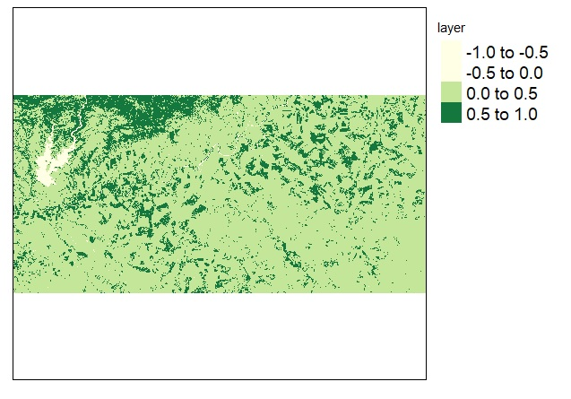

For the remaining years:

```{r}
# 2016
tmap_arrange(NDVI_2016.1_map, 
             NDVI_2016.2_map, 
             ncol=2)
             
# 2017
tmap_arrange(NDVI_2017.1_map, 
             NDVI_2017.2_map, 
             ncol=2)
             
# 2018
tmap_arrange(NDVI_2018.1_map, 
             NDVI_2018.2_map, 
             ncol=2)

# 2019
tmap_arrange(NDVI_2019.1_map, 
             NDVI_2019.2_map, 
             ncol=2)
```

### 2.5 Upload the field vector for clip operations

The field vector selected should be the shapefile polygon of the field. In this particular case, the shapefile was obtained with QGIS considering a topographic characterization of the selected catchment. The catchment was spatially defined according to a map of flow directions (raster) obtained with the SAGA - Wang & Liu algorithm. The algorithm defines water flow and hillshades orientation in a particular area of interest from a DEM. We used a DEM with 5m spatial resolution obtained with LiDAR from CNIG (http://centrodedescargas.cnig.es/CentroDescargas/index.jsp). From that information, a catchment was isolated with an area of approximately 9.5 ha.

```{r}
# Upload field vector
field_vector <- st_read("sentinel/R_analysis/Field_vector.shp")
plot (field_vector$geometry)
```
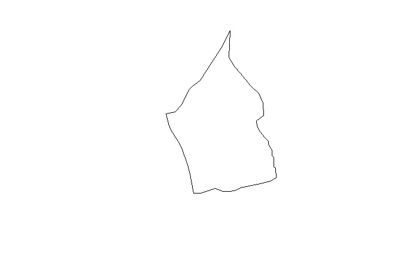

In this step it is also important to check whether the coordinate system is the same as of satellite imagery; in this particular case we will work with the system WGS84 EPSG 4326. [1] "+proj=longlat +datum=WGS84 +no_defs" CRS arguments: +proj=longlat +datum=WGS84 +no_defs +ellps=WGS84 +towgs84=0,0,0 

```{r}
# Check coordinate system
crs(field_vector)
crs(NDVI_2016.1) # as an example to check coordinate system of rasters
```

### 2.6 Cropping and Masking tools

In the following section the script crops and masks the NDVI maps by the field vector shapefile. For more info about these functions please check the outcome and have a look at the following link "https://rpubs.com/ricardo_ochoa/416711"

```{r}
# Crop NDVI data 2015
cropped_feature_2015.1 = crop(NDVI_2015.1, field_vector)
plot (cropped_feature_2015.1)
cropped_feature_2015.2 = crop(NDVI_2015.2, field_vector)
plot (cropped_feature_2015.2)

# Mask NDVI data 2015
masked_feature_2015.1 = mask(NDVI_2015.1, field_vector)
plot(masked_feature_2015.1)
masked_feature_2015.2 = mask(NDVI_2015.2, field_vector)
plot(masked_feature_2015.2)

# Crop NDVI data 2016
cropped_feature_2016.1 = crop(NDVI_2016.1, field_vector)
plot (cropped_feature_2016.1)
cropped_feature_2016.2 = crop(NDVI_2016.2, field_vector)
plot (cropped_feature_2016.2)

# Mask NDVI data 2016
masked_feature_2016.1 = mask(NDVI_2016.1, field_vector)
plot(masked_feature_2016.1)
masked_feature_2016.2 = mask(NDVI_2016.2, field_vector)
plot(masked_feature_2016.2)

# Crop NDVI data 2017
cropped_feature_2017.1 = crop(NDVI_2017.1, field_vector)
plot (cropped_feature_2017.1)
cropped_feature_2017.2 = crop(NDVI_2017.2, field_vector)
plot (cropped_feature_2017.2)

# Mask NDVI data 2017
masked_feature_2017.1 = mask(NDVI_2017.1, field_vector)
plot(masked_feature_2017.1)
masked_feature_2017.2 = mask(NDVI_2017.2, field_vector)
plot(masked_feature_2017.2)

# Crop NDVI data 2018
cropped_feature_2018.1 = crop(NDVI_2018.1, field_vector)
plot (cropped_feature_2018.1)
cropped_feature_2018.2 = crop(NDVI_2018.2, field_vector)
plot (cropped_feature_2018.2)

# Mask NDVI data 2018
masked_feature_2018.1 = mask(NDVI_2018.1, field_vector)
plot(masked_feature_2018.1)
masked_feature_2018.2 = mask(NDVI_2018.2, field_vector)
plot(masked_feature_2018.2)

# Crop NDVI data 2019
cropped_feature_2019.1 = crop(NDVI_2019.1, field_vector)
plot (cropped_feature_2019.1)
cropped_feature_2019.2 = crop(NDVI_2019.2, field_vector)
plot (cropped_feature_2019.2)

# Mask NDVI data 2019
masked_feature_2019.1 = mask(NDVI_2019.1, field_vector)
plot(masked_feature_2019.1)
masked_feature_2019.2 = mask(NDVI_2019.2, field_vector)
plot(masked_feature_2019.2)
```
As an example, the following two figures represent respectively, from left to right, a crop feature and a mask feature, both obtained from 2019.2 satellite imagery:


### 2.7 Visualization mode: Interactive (view) vs. Static (plot) viewing 

Here we provide the basic comand to select interactive (or static) viewing mode of outcomes. 
If you want to get back to the "static" mode please switch 'view' by 'plot' in the function term 'tmap_mode()'

```{r}
tmap_mode("view") 
# or tmap_mode("plot") instead
```

### 2.8 Interactive mapping of masked NDVI rasters

To define the maps:

```{r}
# For 2015
masked_2015.1 <- tm_shape(masked_feature_2015.1) + tm_raster(palette="YlGn",n=10, title="NDVI_05.06.2015") + tm_legend(outside = TRUE, text.size = 1.2)
masked_2015.2 <- tm_shape(masked_feature_2015.2) + tm_raster(palette="YlGn",n=10, title="NDVI_07.07.2015") + tm_legend(outside = TRUE, text.size = 1.2)

# For 2016
masked_2016.1 <- tm_shape(masked_feature_2016.1) + tm_raster(palette="YlGn",n=10, title="NDVI_07.06.2016") + tm_legend(outside = TRUE, text.size = 1.2)
masked_2016.2 <- tm_shape(masked_feature_2016.2) + tm_raster(palette="YlGn",n=10, title="NDVI_23.06.2016") + tm_legend(outside = TRUE, text.size = 1.2)

# For 2017
masked_2017.1 <- tm_shape(masked_feature_2017.1) + tm_raster(palette="YlGn",n=10, title="NDVI_10.06.2017") + tm_legend(outside = TRUE, text.size = 1.2)
masked_2017.2 <- tm_shape(masked_feature_2017.2) + tm_raster(palette="YlGn",n=10, title="NDVI_26.06.2017") + tm_legend(outside = TRUE, text.size = 1.2)

# For 2018
masked_2018.1 <- tm_shape(masked_feature_2018.1) + tm_raster(palette="YlGn",n=10, title="NDVI_22.05.2018") + tm_legend(outside = TRUE, text.size = 1.2)
masked_2018.2 <- tm_shape(masked_feature_2018.2) + tm_raster(palette="YlGn",n=10, title="NDVI_03.06.2018") + tm_legend(outside = TRUE, text.size = 1.2)

# For 2019
masked_2019.1 <- tm_shape(masked_feature_2019.1) + tm_raster(palette="YlGn",n=10, title="NDVI_14.04.2019") + tm_legend(outside = TRUE, text.size = 1.2)
masked_2019.2 <- tm_shape(masked_feature_2019.2) + tm_raster(palette="YlGn",n=10, title="NDVI_27.04.2019") + tm_legend(outside = TRUE, text.size = 1.2)
```

To print them:

```{r}
# For 2015
tmap_arrange(masked_2015.1,
             masked_2015.2,
             ncol=2)
# For 2016             
tmap_arrange(masked_2016.1,
             masked_2016.2,
             ncol=2)
# For 2017             
tmap_arrange(masked_2017.1,
             masked_2017.2,
             ncol=2)
# For 2018
tmap_arrange(masked_2018.1,
             masked_2018.2,
             ncol=2) 
# For 2019
tmap_arrange(masked_2019.1,
             masked_2019.2,
             ncol=2)
```

As an example, check the outcome for 2019:

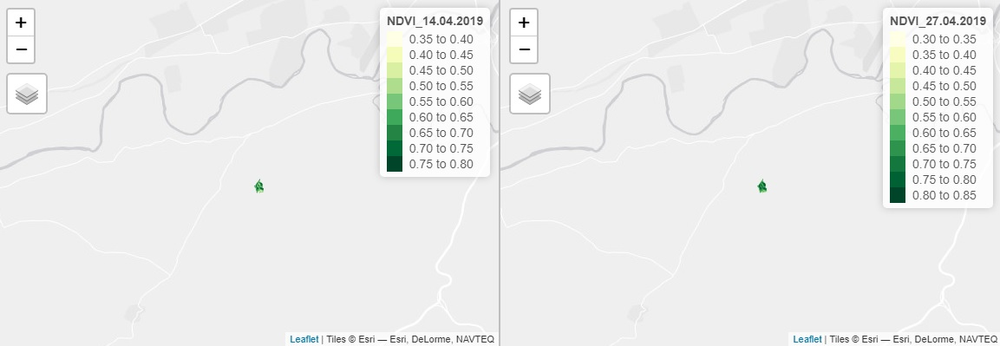

Which can be (interactively) zoomed in: 

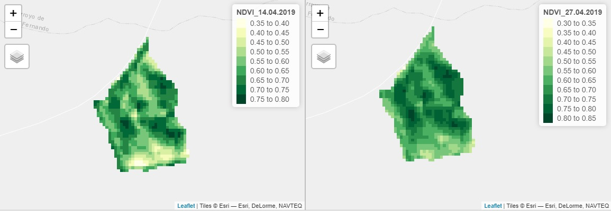

### 2.9 Display facets 

1) We convert raster data into vectorial point-based data while keeping the same (Landsat-8/Sentinel-2) spatial resolution (30x30m/10x10m). 

2) Use of 'tmap_arrange' to display facets for NDVI vectorial mapping.

```{r}
# From raster to point 2015
NDVI_vector_2015.1 <- rasterToPoints(masked_feature_2015.1, spatial = TRUE) %>% st_as_sf()
NDVI_vector_2015.2 <- rasterToPoints(masked_feature_2015.2, spatial = TRUE) %>% st_as_sf()

# Correct feature name
names(NDVI_vector_2015.1)[names(NDVI_vector_2015.1) == "layer"] <- "NDVI_2015.1"
names(NDVI_vector_2015.2)[names(NDVI_vector_2015.2) == "layer"] <- "NDVI_2015.2"

# Create maps for 2015
NDVI_points_2015.1 <- tm_shape(NDVI_vector_2015.1) + tm_dots(col="NDVI_2015.1", palette="YlGn", n=10) + tm_style("cobalt") + 
tm_legend(outside = TRUE, text.size = 1.2)
NDVI_points_2015.2 <- tm_shape(NDVI_vector_2015.2) + tm_dots(col="NDVI_2015.2", palette="YlGn", n=10) + tm_style("cobalt") + 
  tm_legend(outside = TRUE, text.size = 1.2)

# Display facets
tmap_arrange(NDVI_points_2015.1,
             NDVI_points_2015.2,
             ncol=2)
             
# From raster to point 2016
NDVI_vector_2016.1 <- rasterToPoints(masked_feature_2016.1, spatial = TRUE) %>% st_as_sf()
NDVI_vector_2016.2 <- rasterToPoints(masked_feature_2016.2, spatial = TRUE) %>% st_as_sf()

# Correct feature name
names(NDVI_vector_2016.1)[names(NDVI_vector_2016.1) == "layer"] <- "NDVI_2016.1"
names(NDVI_vector_2016.2)[names(NDVI_vector_2016.2) == "layer"] <- "NDVI_2016.2"

# Create maps for 2016
NDVI_points_2016.1 <- tm_shape(NDVI_vector_2016.1) + tm_dots(col="NDVI_2016.1", palette="YlGn", n=10) + tm_style("cobalt") + 
tm_legend(outside = TRUE, text.size = 1.2)
NDVI_points_2016.2 <- tm_shape(NDVI_vector_2016.2) + tm_dots(col="NDVI_2016.2", palette="YlGn", n=10) + tm_style("cobalt") + 
  tm_legend(outside = TRUE, text.size = 1.2)

# Display facets
tmap_arrange(NDVI_points_2016.1,
             NDVI_points_2016.2,
             ncol=2)

# From raster to point 2017
NDVI_vector_2017.1 <- rasterToPoints(masked_feature_2017.1, spatial = TRUE) %>% st_as_sf()
NDVI_vector_2017.2 <- rasterToPoints(masked_feature_2017.2, spatial = TRUE) %>% st_as_sf()

# Correct feature name
names(NDVI_vector_2017.1)[names(NDVI_vector_2017.1) == "layer"] <- "NDVI_2017.1"
names(NDVI_vector_2017.2)[names(NDVI_vector_2017.2) == "layer"] <- "NDVI_2017.2"

# Create maps for 2017
NDVI_points_2017.1 <- tm_shape(NDVI_vector_2017.1) + tm_dots(col="NDVI_2017.1", palette="YlGn", n=10) + tm_style("cobalt") + 
tm_legend(outside = TRUE, text.size = 1.2)
NDVI_points_2017.2 <- tm_shape(NDVI_vector_2017.2) + tm_dots(col="NDVI_2017.2", palette="YlGn", n=10) + tm_style("cobalt") + 
  tm_legend(outside = TRUE, text.size = 1.2)

# Display facets
tmap_arrange(NDVI_points_2017.1,
             NDVI_points_2017.2,
             ncol=2)

# From raster to point 2018
NDVI_vector_2018.1 <- rasterToPoints(masked_feature_2018.1, spatial = TRUE) %>% st_as_sf()
NDVI_vector_2018.2 <- rasterToPoints(masked_feature_2018.2, spatial = TRUE) %>% st_as_sf()

# Correct feature name
names(NDVI_vector_2018.1)[names(NDVI_vector_2018.1) == "layer"] <- "NDVI_2018.1"
names(NDVI_vector_2018.2)[names(NDVI_vector_2018.2) == "layer"] <- "NDVI_2018.2"

# Create maps for 2018
NDVI_points_2018.1 <- tm_shape(NDVI_vector_2018.1) + tm_dots(col="NDVI_2018.1", palette="YlGn", n=10) + tm_style("cobalt") + 
tm_legend(outside = TRUE, text.size = 1.2)
NDVI_points_2018.2 <- tm_shape(NDVI_vector_2018.2) + tm_dots(col="NDVI_2018.2", palette="YlGn", n=10) + tm_style("cobalt") + 
  tm_legend(outside = TRUE, text.size = 1.2)

# Display facets
tmap_arrange(NDVI_points_2018.1,
             NDVI_points_2018.2,
             ncol=2)

# From raster to point 2019
NDVI_vector_2019.1 <- rasterToPoints(masked_feature_2019.1, spatial = TRUE) %>% st_as_sf()
NDVI_vector_2019.2 <- rasterToPoints(masked_feature_2019.2, spatial = TRUE) %>% st_as_sf()

# Correct feature name
names(NDVI_vector_2019.1)[names(NDVI_vector_2019.1) == "layer"] <- "NDVI_2019.1"
names(NDVI_vector_2019.2)[names(NDVI_vector_2019.2) == "layer"] <- "NDVI_2019.2"

# Create maps for 2019
NDVI_points_2019.1 <- tm_shape(NDVI_vector_2019.1) + tm_dots(col="NDVI_2019.1", palette="YlGn", n=10) + tm_style("cobalt") + 
tm_legend(outside = TRUE, text.size = 1.2)
NDVI_points_2019.2 <- tm_shape(NDVI_vector_2019.2) + tm_dots(col="NDVI_2019.2", palette="YlGn", n=10) + tm_style("cobalt") + 
  tm_legend(outside = TRUE, text.size = 1.2)

# Display facets
tmap_arrange(NDVI_points_2019.1,
             NDVI_points_2019.2,
             ncol=2)
```

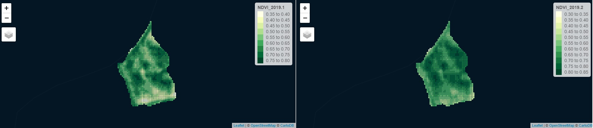

## 3 Geo-spatial analysis of field data

### 3.1 Display sampling and ECa measuring photos

Some photos of the measures taken with a Dualem sensor (i.e. electromagnetic induction sensor), spatial resolution of 1x15m. Soil ECa was measured at 35 and 85 cm depth before sowing and a few days after a rainfall event of aprox. 10 mm. Soil samples were also collected to estimate pH and clay content. 

For more info in regard to ECa sensing/mapping please read:

- Johnson, C. K., Doran, J. W., Duke, H. R., Wienhold, B. J., Eskridge, K. M., & Shanahan, J. F. (2001). Field-scale electrical conductivity mapping for delineating soil condition. Soil Science Society of America Journal, 65(6), 1829-1837.

- McCutcheon, M. C., Farahani, H. J., Stednick, J. D., Buchleiter, G. W., & Green, T. R. (2006). Effect of soil water on apparent soil electrical conductivity and texture relationships in a dryland field. Biosystems Engineering, 94(1), 19-32.

```{r}
# Upload libraries 'imager' and 'png'
library(knitr)    # For knitting document and include_graphics function
library(ggplot2)  # For plotting
library(png)      # For grabbing the dimensions of png files

#Define file ath
img1_path <- "sentinel/R_analysis/Pictures_Sampling/1.png"
img2_path <- "sentinel/R_analysis/Pictures_Sampling/2.png"
img3_path <- "sentinel/R_analysis/Pictures_Sampling/3.png"
img4_path <- "sentinel/R_analysis/Pictures_Sampling/4.png"
img5_path <- "sentinel/R_analysis/Pictures_Sampling/3.png"
img6_path <- "sentinel/R_analysis/Pictures_Sampling/4.png"

# Display pictures
include_graphics(img1_path) 
include_graphics(img2_path) 
include_graphics(img3_path) 
include_graphics(img4_path) 
include_graphics(img5_path) 
include_graphics(img6_path) 
```


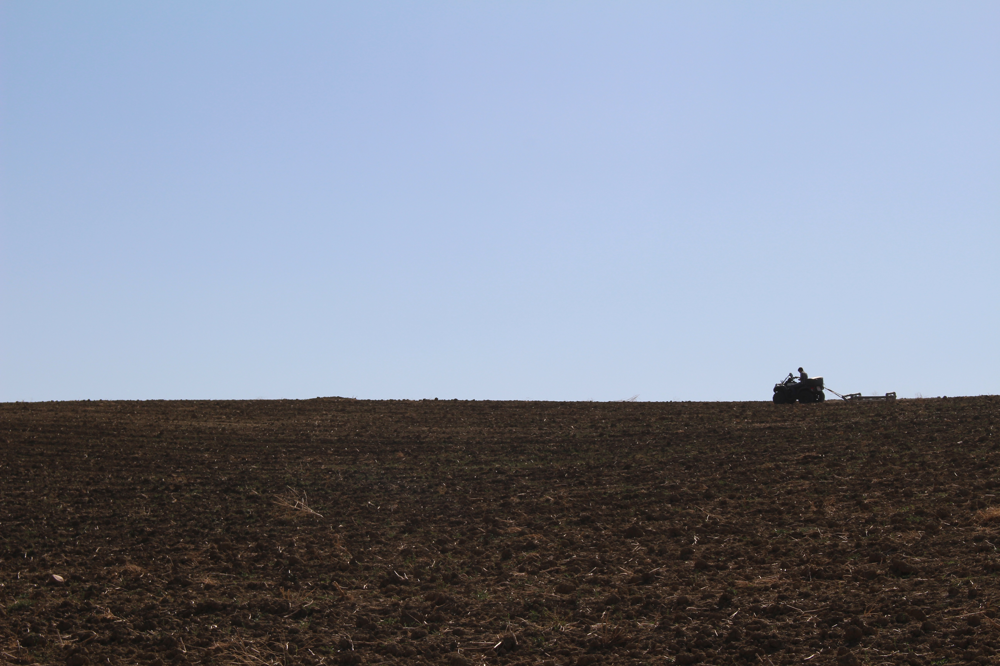


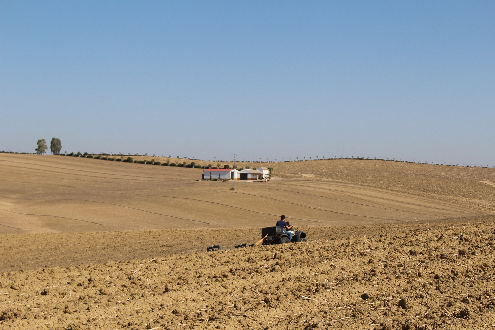

### 3.2 Upload soil physical and chemical data 

Data collected at 10th October 2019 

Field location: Guadálcazar, Córdoba, Spain

Four different types of properties:
1) Soil texture (%Clay, %Sand);
2) Soil ECa (35 and 85 cm depth);
3) Slope orientation;
4) Elevation (m);

```{r}
# Upload raster data
GF_Elevation     <- raster("GF_Elevation.tif")
GF_Orientation   <- raster("GF_Orientation.tif")
GF_ECa1          <- raster("GF_CEa1.tif")
GF_ECa2          <- raster("GF_CEa2.tif")

# Convert to point vectorial data
GF_Elevation_dots <- rasterToPoints(GF_Elevation, spatial = TRUE) %>% st_as_sf()
names(GF_Elevation_dots)[names(GF_Elevation_dots) == "GF_Elevation"] <- "Elevation"
GF_Orientation_dots <- rasterToPoints(GF_Orientation, spatial = TRUE) %>% st_as_sf()
names(GF_Orientation_dots)[names(GF_Orientation_dots) == "GF_Orientation"] <- "Orientation"
GF_ECa1_dots <- rasterToPoints(GF_ECa1, spatial = TRUE) %>% st_as_sf()
names(GF_ECa1_dots)[names(GF_ECa1_dots) == "GF_CEa1"] <- "ECa1"
GF_ECa2_dots <- rasterToPoints(GF_ECa2, spatial = TRUE) %>% st_as_sf()
names(GF_ECa2_dots)[names(GF_ECa2_dots) == "GF_CEa2"] <- "ECa2"
```

## 3.3. Join field data and NDVI data on a single shapefile

Here we run a spatial join in order to build a single shapefile containing point based data (10x10m) with plant vigor (NDVI), soil physical properties (elevation, orientation, ECa, texture) and chemical data (pH).

```{r}
# Start spatial join (NDVI + Elevation + Orientation + ECa)
rm(MZ_joined)
MZ_joined = st_join(NDVI_vector_2019.1, NDVI_vector_2019.2["NDVI_2019.2"], join = st_nearest_feature)

MZ_joined = st_join(MZ_joined, NDVI_vector_2018.1["NDVI_2018.1"], join = st_nearest_feature)
MZ_joined = st_join(MZ_joined, NDVI_vector_2018.2["NDVI_2018.2"], join = st_nearest_feature)
MZ_joined = st_join(MZ_joined, NDVI_vector_2017.1["NDVI_2017.1"], join = st_nearest_feature)
MZ_joined = st_join(MZ_joined, NDVI_vector_2017.2["NDVI_2017.2"], join = st_nearest_feature)
MZ_joined = st_join(MZ_joined, NDVI_vector_2016.1["NDVI_2016.1"], join = st_nearest_feature)
MZ_joined = st_join(MZ_joined, NDVI_vector_2016.2["NDVI_2016.2"], join = st_nearest_feature)
MZ_joined = st_join(MZ_joined, NDVI_vector_2015.1["NDVI_2015.1"], join = st_nearest_feature)
MZ_joined = st_join(MZ_joined, NDVI_vector_2015.2["NDVI_2015.2"], join = st_nearest_feature)

MZ_joined = st_join(MZ_joined, GF_Elevation_dots["Elevation"], join = st_nearest_feature)
MZ_joined = st_join(MZ_joined, GF_Orientation_dots["Orientation"], join = st_nearest_feature)
MZ_joined = st_join(MZ_joined, GF_ECa1_dots["ECa1"], join = st_nearest_feature)
MZ_joined = st_join(MZ_joined, GF_ECa2_dots["ECa2"], join = st_nearest_feature)

# Convert Eca from mS/m to dS/m and estimate ECa mean
MZ_joined$ECa1     <- MZ_joined$ECa1/100
MZ_joined$ECa2     <- MZ_joined$ECa2/100
MZ_joined$EC_mean  <- ((MZ_joined$ECa1+MZ_joined$ECa2)/2)

# A simple classification of soil texture proposed by Greenfields: http://www.greenfield.agrodrone.es/ 
MZ_joined$Texture  <- "Clay_loamy"
MZ_joined$Texture[MZ_joined$ECa2 > 0.60]  <- "Clay"
MZ_joined$Texture[MZ_joined$ECa1 < 0.10]  <- "Clay_loamy"
tm_shape(MZ_joined) + tm_dots(col = "Texture", palette = "RdYlGn", n=2) + tm_style("cobalt")
```
 

### 3.4 Soil sampling for pH and %clay mapping

A total of 10 soil samples were collected at 40cm according to a clustering of ECa. Data is spatially interpolated following a 'nearest-feature' algorithm in order to produce point based vectorial maps with the same spatial resolution of MZ_joined.  

```{r}
# Upload sampling dots
Sampling_vector <- st_read("Sampling_dots.shp")
Sampling_map    <- tm_shape(Sampling_vector) + tm_dots(col = "green", palette = "RdYlGn", n=6) + tm_style("cobalt")
Sampling_map  

# Rename: translating from Spanish to English
names(Sampling_vector)[names(Sampling_vector) == "ARCILLA"] <- "Clay"
names(Sampling_vector)[names(Sampling_vector) == "PH"] <- "pH"
names(Sampling_vector)[names(Sampling_vector) == "ARENA"] <- "Sand"
```

A few sampling photos

```{r}
#Define file path
img7_path <- "sentinel/R_analysis/Pictures_Sampling/7.png"
img8_path <- "sentinel/R_analysis/Pictures_Sampling/8.png"

# Display pictures
include_graphics(img7_path) 
include_graphics(img8_path) 
```


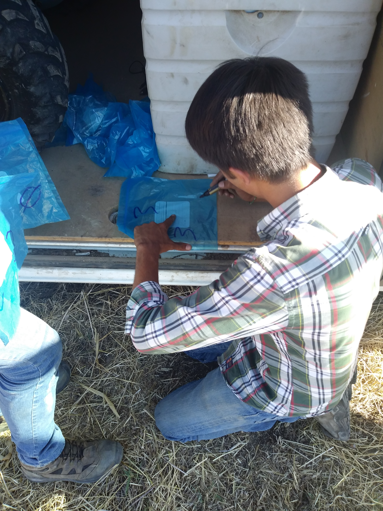

```{r}
# Spatial join
MZ_joined = st_join(MZ_joined, Sampling_vector["Clay"], join = st_nearest_feature)
MZ_joined = st_join(MZ_joined, Sampling_vector["pH"], join = st_nearest_feature)
MZ_joined = st_join(MZ_joined, Sampling_vector["Sand"], join = st_nearest_feature)

# Map sampling points
Clay_map <- tm_shape(MZ_joined) + tm_dots(col = "Clay", palette = "YlOrBr", n=8, size = 0.3) #+ tm_style("cobalt") 
Sand_map <- tm_shape(MZ_joined) + tm_dots(col = "Sand", palette = "Oranges", n=8, size = 0.3) #+ tm_style("cobalt") 
pH_map   <- tm_shape(MZ_joined) + tm_dots(col = "pH", palette = "Blues", n=5, size = 0.3) #+ tm_style("cobalt")

# Display
tmap_mode("plot") 
tmap_arrange(Clay_map,
             Sand_map,
             pH_map,
             ncol=3)
```

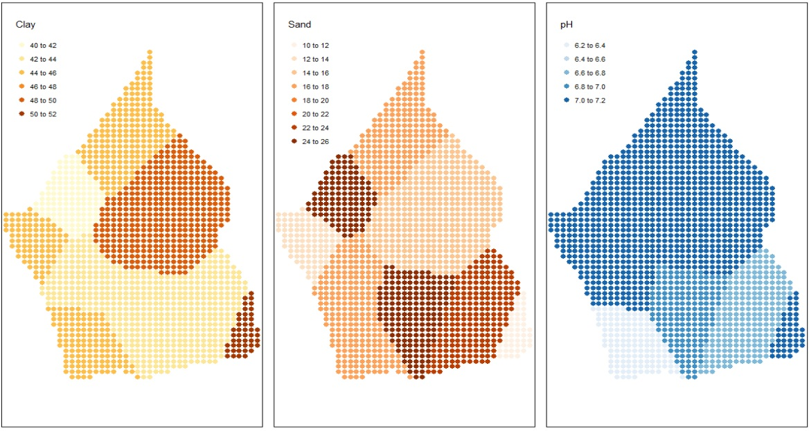

### 3.5 Descriptive statistics - coefficient of variation (CV)

```{r}
# Estimate CV
cv_Clay      = cv(MZ_joined$Clay)
cv_Sand      = cv(MZ_joined$Sand)
cv_pH        = cv(MZ_joined$pH)

cv_ECa1      = cv(MZ_joined$ECa1)
cv_ECa2      = cv(MZ_joined$ECa2)
cv_O         = cv(MZ_joined$Orientation)
cv_E         = cv(MZ_joined$Elevation)

cv_NDVI_2019.1 = cv(MZ_joined$NDVI_2019.1)
cv_NDVI_2019.2 = cv(MZ_joined$NDVI_2019.2)
cv_NDVI_2018.1 = cv(MZ_joined$NDVI_2018.1)
cv_NDVI_2018.2 = cv(MZ_joined$NDVI_2018.2)
cv_NDVI_2017.1 = cv(MZ_joined$NDVI_2017.1)
cv_NDVI_2017.2 = cv(MZ_joined$NDVI_2017.2)
cv_NDVI_2016.1 = cv(MZ_joined$NDVI_2016.1)
cv_NDVI_2016.2 = cv(MZ_joined$NDVI_2016.2)
cv_NDVI_2015.1 = cv(MZ_joined$NDVI_2015.1)
cv_NDVI_2015.2 = cv(MZ_joined$NDVI_2015.2)
```

Printed results:

| Variable | CV| Variable | CV |
|----------|---|----------|----|
|pH | 3.32%| - | - |
|Clay   | 6.65%| Sand| 25.97%|
|Orientation | 61.83 %|Elevation |4.86%|
|ECa1 | 39.38%|ECa2 | 26.77%|
|NDVI_2019.1 | 13.16%|NDVI_2019.2 | 11.97%|
|NDVI_2018.1 | 16.53%|NDVI_2018.2 | 18.01%|
|NDVI_2017.1 | 10.08%|NDVI_2017.2 | 11.13%|
|NDVI_2016.1 | 10.21%|NDVI_2016.2 | 7.47%|
|NDVI_2015.1 | 13.99%|NDVI_2015.2 | 10.68%|


According to Oliver. (2010), we consider as low, medium or high CV all values, respectively, ranged below 10%, between 10 and 25% and above 25%. 

- Oliver, M. A. (Ed.). (2010). Geostatistical applications for precision agriculture. Springer Science & Business Media.

## 4 Data hierarchical considerations

### 4.1 Filtering data with Principal Component Analysis (PCA)

```{r}
install.packages("devtools")
library(devtools)
install_github("vqv/ggbiplot")
library(ggbiplot)
install.packages("factoextra")
library(factoextra)
install.packages("ggfortify")
library(ggfortify)
library(cluster)

MZ_joined$NDVI_2019 <- ((MZ_joined$NDVI_2019.1 + MZ_joined$NDVI_2019.2 / 2))
MZ_joined$NDVI_2018 <- ((MZ_joined$NDVI_2018.1 + MZ_joined$NDVI_2018.2 / 2))
MZ_joined$NDVI_2017 <- ((MZ_joined$NDVI_2017.1 + MZ_joined$NDVI_2017.2 / 2))
MZ_joined$NDVI_2016 <- ((MZ_joined$NDVI_2016.1 + MZ_joined$NDVI_2016.2 / 2))
MZ_joined$NDVI_2015 <- ((MZ_joined$NDVI_2015.1 + MZ_joined$NDVI_2015.2 / 2))

MZ_joined$ID <- seq.int(nrow(MZ_joined))

rm(dataframe)
dataframe = fortify(MZ_joined)
dataframe$geometry <- NULL

dataframe <- dataframe[,c(11:14,17:19,20:25)]

data.pca <- prcomp(dataframe[,c(1:12)], scale = TRUE)

summary(data.pca)
autoplot(data.pca, colour = 'white', loadings = TRUE, loadings.label = TRUE, loadings.label.size  = 5)

data.pca$rotation
```
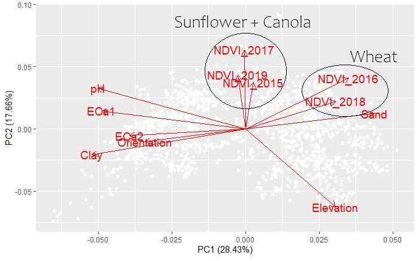

We observe that NDVI data are clustered for the first principal component, which explains about 28% of total variation, in two separate groups: 1) wheat and 2) sunflower + canola. Apparently, crops vigor might co-variate with geophysical properties in similar forms according to these two groups, highlighting the crop type effect on spatial correlations. All variables were analysed according to the PC-scores. The PC-scores were calculated as the sum of modules for each of the two principal components (capable to explain about 47% of total variation within the field). We aim to identify the highest correlations by selecting variables that are defined by the largest (and similar) space vectors within the PCA plot. These are the variables that reveal the largest co-variation within the field. We proceed to select all variables with PC-scores higher than 0.5 for the two principal components. Six variables are selected, four geophysical related (Elevation, Clay, pH and ECa1) and two crop (biological) based (NDVI 2017 and 2016). 

| Variable	| PC1	| PC2	| Mod-PC1 |Mod-PC2|	PC-score | Water stress |	Crop |
|-----------|-----|-----|------------|----------|----------|--------------|------|
|**Elevation**	| 0.246073496	|-0.506219	|0.246073496	|0.506219	|**0.752292496** |	*not applicable* |*not applicable* |
|Orientation|	-0.275479193	| -0.0846252 |	0.275479193	| 0.0846252	| 0.360104393	|	*not applicable* |*not applicable* |
|**Clay**	|-0.420774692|	-0.1664644|	0.420774692	|0.1664644|	**0.587239092**		|*not applicable* |*not applicable*|
|Sand	|0.352315578|	0.0992921	|0.352315578	|0.0992921	|0.451607678		|*not applicable* |*not applicable*|
|**pH**	|-0.404608422|	0.2629256|	0.404608422|	0.2629256|	**0.667534022**		|*not applicable* |*not applicable*|
|**ECa1**	|-0.395116982	|0.116692|	0.395116982	|0.116692|	**0.511808982**		|*not applicable* |*not applicable*|
|ECa2   | -0.318056254|	-0.0449851|	0.318056254     |0.0449851	|0.363041354|  *not applicable* |*not applicable*|
|NDVI	2019|	-0.020251927|	0.3492063	|0.020251927|	0.3492063|	0.369458227	|0.46	|Canola|
| NDVI	2018	| 0.246998629|	0.1780563|	0.246998629|	0.1780563	|0.425054929	|0.06	|Wheat|
|**NDVI 2017**|	-0.003134472	|0.511726	|0.003134472	|0.511726|	**0.514860472**	|0.29	|Sunflower|
|**NDVI	2016**|	0.281983167|	0.3287212	|0.281983167|	0.3287212	|**0.610704367**|	0.27	|Wheat|
|NDVI	2015|	0.021294623	|0.3011159	|0.021294623	|0.3011159	|0.322410523|	0.47	|Sunflower|

Water stress is determined as the division of gross season rainfall by growing season ET0. Considering the high water retention capacity of these soils, gross season rainfall was considered from September to the harvesting date, while season ET0 was considered for the aproximated growing season: November-June in the case of winter wheat, March-August for Sunflower, and October-May for canola. A water stress index of 0 means full requirements covered (i.e. total ET0 fully covered by season rainfall), a water stress of 30% means that season rainfall was 70% of total ET0, a water stress of 0 would mean absolute lack of rainfall. Data collected from: http://www.juntadeandalucia.es/agriculturaypesca/

### 4.2 Build dataframe for k-means clustering

In this step we build a sub dataframe for clustering and we check the optimal amount of clusters (k=3) with two methods conducted on scaled data. For more information, please check the following references:

- Rousseeuw, P. J. (1987). Silhouettes: A graphical aid to the interpretation and validation of cluster analysis. J. Comput.
Appl. Math., 20:53–65.

- Tibshirani, R., Walther, G., and Hastie, T. (2001). Estimating the number of clusters in a data set via the gap statistic. J.
R. Stat. Soc. Series B Stat. Methodol., 63(2):411–423.

```{r}
library(cluster)

data <- dataframe[c(1,3,5:6,10:11,13)]
data.scale <- scale(data[,c(1:6)])

# Silhouette method
fviz_nbclust(data.scale, kmeans, method = "silhouette")+
  labs(subtitle = "Silhouette method")

# Gap statistic
fviz_nbclust(data.scale, kmeans, method = "gap_stat")+
  labs(subtitle = "Gap Stat method")
```

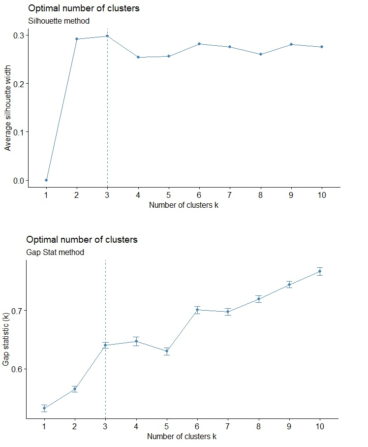

### 4.3 Unsupervised k-means clustering

Uploading libraries and applying k-means to the dataset; please do not forget to scale your data.

``` {r}
library(dplyr)
library(tidyverse) # data manipulation
library(corrplot)
library(gridExtra)
library(GGally)
library(cluster) # clustering algorithms 
library(factoextra) 

rm(data_1)
data_1 <- data.scale
df.1 <- data
data.scale_1 <- data_1

rm(cluster)
set.seed(125)
cluster <- kmeans(data.scale_1, 3)
df.1$cluster <- cluster$cluster

# Plot the cluster
fviz_cluster(cluster, data = df.1)

# Add clusters to spatial data
rm(mergedata)
df.1 <- df.1[c(7,8)]
mergedata <- merge(x = MZ_joined, y = df.1, by = "ID")

# Recall data
names(mergedata)[names(mergedata) == "cluster"] <- "ZONE"

# Prepare map
mergedata$ZONE[mergedata$ZONE == "1"] <- "A"
mergedata$ZONE[mergedata$ZONE == "2"] <- "B"
mergedata$ZONE[mergedata$ZONE == "3"] <- "C"
```
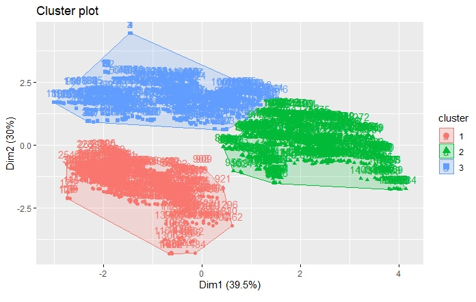

Get yield maps from yield monitoring or modelling simulations:

```{r}
# Simulated Yield maps from NDVI

# For canola 2019
mergedata$Yield_2019 <- 0
HI = 0.2
mergedata$Yield_2019 <- (5738.5 * (mergedata$NDVI_2019^2) - (3109.4 * mergedata$NDVI_2019) + 385.77) * 10000 / 1000 * HI / 1000 

# For wheat 2018
mergedata$Yield_2018 <- 0
mergedata$Yield_2018 <- ((-83.49*(mergedata$NDVI_2018^3))+(127.82*(mergedata$NDVI_2018^2))+(-49.975*(mergedata$NDVI_2018))+6.975)
mergedata$Yield_2018[mergedata$Yield_2018<0] <- 0

# For sunflower 2017
mergedata$Yield_2017 <- 0
mergedata$Yield_2017 <- (3.6115*mergedata$NDVI_2017)-0.5071
mergedata$Yield_2017[mergedata$Yield_2017<0] <- 0

# For wheat 2016
mergedata$Yield_2016 <- 0
mergedata$Yield_2016 <- ((-83.49*(mergedata$NDVI_2016^3))+(127.82*(mergedata$NDVI_2016^2))+(-49.975*(mergedata$NDVI_2016))+6.975)
mergedata$Yield_2016[mergedata$Yield_2016<0] <- 0

# For sunflower 2015
mergedata$Yield_2015 <- 0
mergedata$Yield_2015 <- (3.6115*mergedata$NDVI_2015)-0.5071
mergedata$Yield_2015[mergedata$Yield_2015<0] <- 0
```

Map your results:

```{r}
# Define Management Zones map
mycols <- c("#3CB371", "#7B68EE", "#FFA07A", "#FFD700")
map_MZ             <- tm_shape(mergedata) + tm_dots(col = "ZONE", palette = mycols, n=5) + tm_style("cobalt") 

# Define Yield maps
map_Yield.2015      <- tm_shape(mergedata) + tm_dots(col = "Yield_2015", palette = "RdYlGn", n=6) + tm_style("cobalt") 
map_Yield.2016      <- tm_shape(mergedata) + tm_dots(col = "Yield_2016", palette = "RdYlGn", n=6) + tm_style("cobalt") 
map_Yield.2017      <- tm_shape(mergedata) + tm_dots(col = "Yield_2017", palette = "RdYlGn", n=2) + tm_style("cobalt") 
map_Yield.2018      <- tm_shape(mergedata) + tm_dots(col = "Yield_2018", palette = "RdYlGn", n=6) + tm_style("cobalt") 
map_Yield.2019      <- tm_shape(mergedata) + tm_dots(col = "Yield_2019", palette = "RdYlGn", n=6) + tm_style("cobalt") 


# Display facets (units are expressed in ton/ha)

tmap_arrange(map_MZ,
             map_Yield.2015,
             map_Yield.2016,
             map_Yield.2017,
             ncol=4)

tmap_arrange(map_Yield.2018,
             map_Yield.2019,
             ncol=4)
```

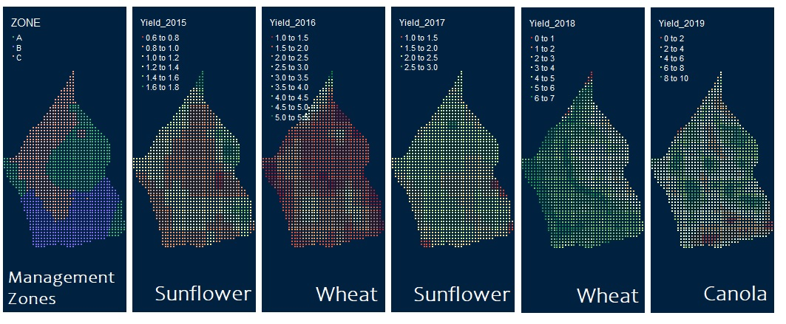

### 4.4 Statistical analysis of clustering results

```{r}

rm(stats)
stats <- mergedata[,c(12,14,18:19,26,28:32)]

## Get LAT-LON coordindates

library(rgdal)
library(gstat)
library(lattice)
library(geoR)
library(RColorBrewer)

rm(stats_data)
stats_data <- stats[c(1:11)]
stats_data$geometry <- NULL

rm(coords)
coords <- do.call(rbind, st_geometry(mergedata)) %>% 
    as_tibble() %>% setNames(c("lon","lat"))

stats_data <- cbind(stats_data, coords[,1:2])

stats_data$Y <- stats_data$lat * 111.32 * 1000
stats_data$X <- stats_data$lon * ((-0.0137*(stats_data$lat^2))-(0.1004*stats_data$lat)+111.49) * 1000

# Aggregate Means

aggregate(stats$Elevation, by=list(stats$ZONE), FUN=mean)
aggregate(stats$Elevation, by=list(stats$ZONE), FUN=sd)

aggregate(stats$ECa1, by=list(stats$ZONE), FUN=mean)
aggregate(stats$ECa1, by=list(stats$ZONE), FUN=sd)

aggregate(stats$Clay, by=list(stats$ZONE), FUN=mean)
aggregate(stats$Clay, by=list(stats$ZONE), FUN=sd)

aggregate(stats$pH, by=list(stats$ZONE), FUN=mean)
aggregate(stats$pH, by=list(stats$ZONE), FUN=sd)

aggregate(stats$Yield_2015, by=list(stats$ZONE), FUN=mean)
aggregate(stats$Yield_2015, by=list(stats$ZONE), FUN=sd)

aggregate(stats$Yield_2016, by=list(stats$ZONE), FUN=mean)
aggregate(stats$Yield_2016, by=list(stats$ZONE), FUN=sd)

aggregate(stats$Yield_2017, by=list(stats$ZONE), FUN=mean)
aggregate(stats$Yield_2017, by=list(stats$ZONE), FUN=sd)

aggregate(stats$Yield_2018, by=list(stats$ZONE), FUN=mean)
aggregate(stats$Yield_2018, by=list(stats$ZONE), FUN=sd)

aggregate(stats$Yield_2019, by=list(stats$ZONE), FUN=mean)
aggregate(stats$Yield_2019, by=list(stats$ZONE), FUN=sd)

```

| Variable/Zone | 	A	| B	| C	| Water stress |
|---------------|-----|---|---|--------------|
|Elevation	|177.18 (6.3)	|187.73 (4.6)	|171.27 (5.1)	|*not applicable* |
|ECa1	|0.17(0.05)|	0.09 (0.04)	|0.17 (0.05)	| *not applicable* |
|Clay	|47.8 (1.9)|	42.5 (0.8)|	42.5 (1.7)	|*not applicable*  |
|pH	|7.16 (0.04)	|6.7 (0.22)|	7 (0.05)	| *not applicable* |
|Yield_2015|	1.03 (0.23)|	1.02 (0.13)	|1.06 (0.14)	|0.47|
|Yield_2016| 1.66 (0.18)|	2.09 (0.33)	|2.18 (0.51)|	0.27|
|Yield_2017|	2.01 (0.24)	|1.96 (0.24)	|2.21 (0.19)	|0.29|
|Yield_2018|	4.28 (0.97)	|5.34 (0.86)	|5.31 (0.85)	|0.06|
|Yield_2019|	5.65 (1.77)	|4.72 (1.80)	|5.8 (1.46)|	0.46|


### 4.5 Geo-statistical analysis 

```{r}
g_2015 <- ggplot(stats_data, aes(X, Y)) +
geom_point(aes(colour = Yield_2015),size=3) + scale_colour_gradient(low="orange", high="forestgreen") +
labs(colour = "Yield (ton/ha)", x="Longitude", y="Latitude", title = "Sample Yield Monitor Data")

g_2016 <- ggplot(stats_data, aes(X, Y)) +
geom_point(aes(colour = Yield_2016),size=3) + scale_colour_gradient(low="orange", high="forestgreen") +
labs(colour = "Yield (ton/ha)", x="Longitude", y="Latitude", title = "Sample Yield Monitor Data")

g_2017 <- ggplot(stats_data, aes(X, Y)) +
geom_point(aes(colour = Yield_2017),size=3) + scale_colour_gradient(low="orange", high="forestgreen") +
labs(colour = "Yield (ton/ha)", x="Longitude", y="Latitude", title = "Sample Yield Monitor Data")

g_2018 <- ggplot(stats_data, aes(X, Y)) +
geom_point(aes(colour = Yield_2018),size=3) + scale_colour_gradient(low="orange", high="forestgreen") +
labs(colour = "Yield (ton/ha)", x="Longitude", y="Latitude", title = "Sample Yield Monitor Data")

g_2019 <- ggplot(stats_data, aes(X, Y)) +
geom_point(aes(colour = Yield_2019),size=3) + scale_colour_gradient(low="orange", high="forestgreen") +
labs(colour = "Yield (ton/ha)", x="Longitude", y="Latitude", title = "Sample Yield Monitor Data")

g_MZ <- ggplot(stats_data, aes(X, Y)) +
geom_point(aes(colour = ZONE),size=3) + 
labs(colour = "Yield (ton/ha)", x="Longitude", y="Latitude", title = "Sample Yield Monitor Data")

grid.arrange(g_2015, g_2016, g_2017, g_2018, g_2019, g_MZ,
             ncol = 2, nrow = 3)
```

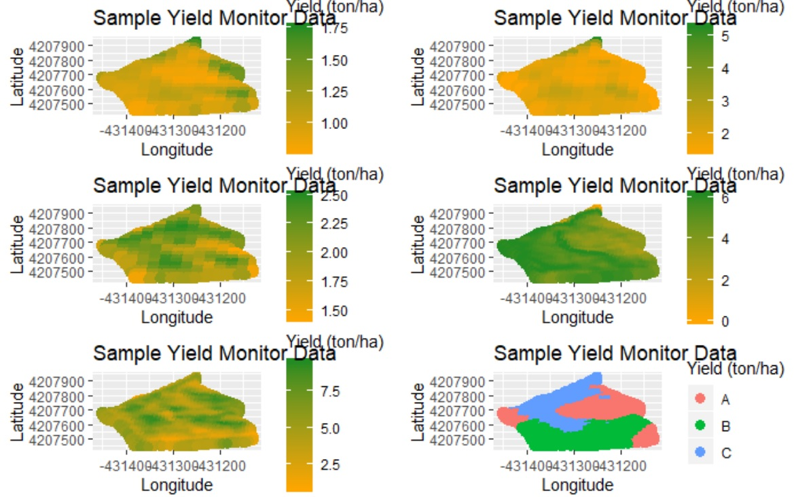


```{r}
## Variograms
Yield_2015.var <- variogram(Yield_2015~1,
locations=~X+Y,
data=stats_data)
plot(Yield_2015.var)

Yield_2016.var <- variogram(Yield_2016~1,
locations=~X+Y,
data=stats_data)
plot(Yield_2016.var)

Yield_2017.var <- variogram(Yield_2017~1,
locations=~X+Y,
data=stats_data)
plot(Yield_2017.var)

Yield_2018.var <- variogram(Yield_2018~1,
locations=~X+Y,
data=stats_data)
plot(Yield_2018.var)

Yield_2019.var <- variogram(Yield_2019~1,
locations=~X+Y,
data=stats_data)
plot(Yield_2019.var)

#vgm(psill = NA, model, range = NA, nugget, add.to, anis, kappa = 0.5, covtable, Err = 0)

print(Yield_2015.vgm <- fit.variogram(Yield_2015.var, vgm(0.02,"Sph",100,0)))
plot(Yield_2015.var, model=Yield_2015.vgm)

print(Yield_2016.vgm <- fit.variogram(Yield_2016.var, vgm(0.02,"Sph",100,0)))
plot(Yield_2016.var, model=Yield_2016.vgm)

print(Yield_2017.vgm <- fit.variogram(Yield_2017.var, vgm(0.02,"Sph",100,0)))
plot(Yield_2017.var, model=Yield_2017.vgm)

print(Yield_2018.vgm <- fit.variogram(Yield_2018.var, vgm(0.02,"Sph",100,0)))
plot(Yield_2018.var, model=Yield_2018.vgm)

print(Yield_2019.vgm <- fit.variogram(Yield_2019.var, vgm(0.02,"Sph",100,0)))
plot(Yield_2019.var, model=Yield_2019.vgm)
```

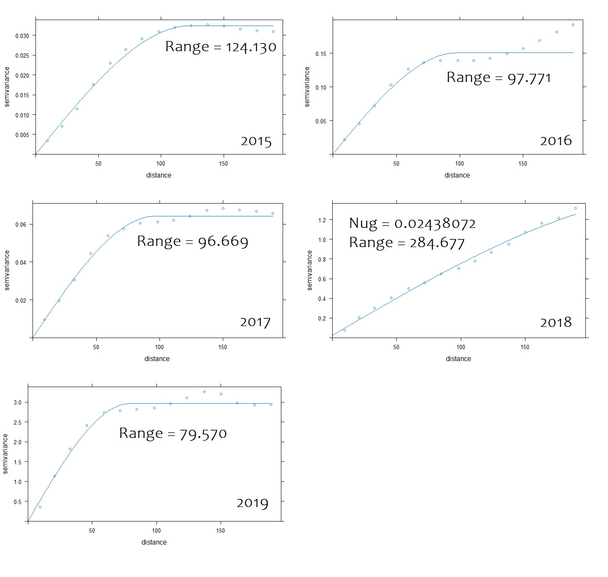

Most of the years fitted into variograms with 'monotonic increasing  slope', which indicates that yield was spatially dependent or autocorrelated (for a Lag distance of aprox. 80-120m). All years, except 2018, fit into a variogram that reaches an upper bound after the initial slope. For 2018, we obtained one 'unbounded variogram' with a Lag distance > 280m, indicating that the correlation range is larger than the distance. This might indicate that our plot is too small for an accurate analysis of spatial variation in 2018.              
```{r}
# Cumulative probabilities - plots
g_1 <- ggplot(stats_data, aes(Yield_2015, colour = ZONE)) + stat_ecdf() + ggtitle("Cumulative Probability - Yield 2015") 
g_2 <- ggplot(stats_data, aes(Yield_2016, colour = ZONE)) + stat_ecdf() + ggtitle("Cumulative Probability - Yield 2016")
g_3 <- ggplot(stats_data, aes(Yield_2017, colour = ZONE)) + stat_ecdf() + ggtitle("Cumulative Probability - Yield 2017")
g_4 <- ggplot(stats_data, aes(Yield_2018, colour = ZONE)) + stat_ecdf() + ggtitle("Cumulative Probability - Yield 2018")
g_5 <- ggplot(stats_data, aes(Yield_2019, colour = ZONE)) + stat_ecdf() + ggtitle("Cumulative Probability - Yield 2019")

# Print
grid.arrange(g_1, g_2, g_3, g_4, g_5,
             ncol = 2, nrow = 3)
```

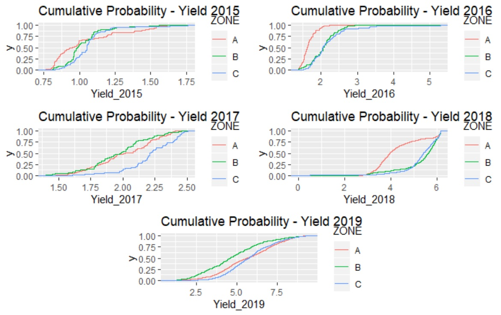

The cumulative plots indicate consistency of MZ-C as the highest yielding zone. The zone C has yielded the most in all years. However, these differences must only be considered for 2016, 2017 and 2018. At 50% probability, winter wheat yield differences varied on about 1 ton/ha among MZ's. Larger differences were observed for 2018 (i.e. about 2 ton/ha). Sunflower yields varied among MZ's under a similar order of magnitude (2017). As the MZ-C was the highest yielding zone for the majority of years, the MZ-A has shown to be the lowest. Inconsistency is observed for the case of MZ-B, which yielded the most with wheat (2016 and 2018) but the least with sunflower (2017). 

The cumulative probabilities for 2015 and 1019 indicate unsubstantial differences among MZ's. Both years were characterized by water shortage (i.e. water stress index of about 50%). We may note that the spatial variation of yield and the differentiation of yield classes by MZ were irrelevant for both years of high level of water stress. For both 2015 and 2019, yields seem to have been limitted by water supply and the potential productivities of different MZ's were homogeneized. 

Two major observations deserve to be done. Despite the spatial correlation of yield variation, differences in both 2015 and 2017 were too low to delineate MZ's. For the remaining years, two of them were capable to explain most of the variation but assimetric yield patterns caused by different *crop x year* settings reveal inconsistency on the relation between MZ and yield for at least one MZ (i.e. Zone B). The data fitted into variograms with different structures (i.e. small variations of the Lag distance and different curve shapes), which also indicates that the spatial variation was not uniform from year to year. This is partly associated to the year effect (here quantified as the water stress ratio) and it was also related to the crop species (zone B yields relatively more or less according to the species: wheat (2016 and 2018) vs. sunflower (2017).

```{r}
# Explore geophysical differences among MZ's
g_clay <- ggplot(stats_data, aes(Clay, colour = ZONE)) + stat_ecdf() + ggtitle("Cumulative Probability - Clay %") 
g_E <- ggplot(stats_data, aes(Elevation, colour = ZONE)) + stat_ecdf() + ggtitle("Cumulative Probability - Elevation") 
g_pH <- ggplot(stats_data, aes(pH, colour = ZONE)) + stat_ecdf() + ggtitle("Cumulative Probability - pH") 
g_ECa1 <- ggplot(stats_data, aes(ECa1, colour = ZONE)) + stat_ecdf() + ggtitle("Cumulative Probability - ECa1") 

grid.arrange(g_E, g_clay, g_pH, g_ECa1,
             ncol = 2, nrow = 2)
```
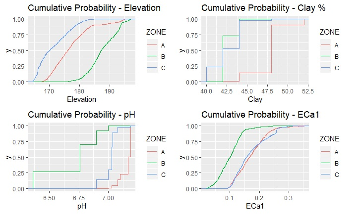

|Variable|Zone A|Zone B|Zone C|
|--------|------|------|------|
|Elevation|Medium|High|Low|
|% Clay| Higher | Lower | Lower|
|pH | *non limitting* |*non limitting* |*non limitting* |
|ECa1|Higher|Lower|Higher|
|Wheat yield| Lower | Higher | Higher|
|Sunflower yield| Lower|Lower|Higher|

```{r}
# Correlograms for quantification of spatial dependence according to Nielsen & Alemi. (1989)

# First Correlogram Example
install.packages("corrgram")
library(corrgram)
library(GGally)

stats_crr <- stats_data[c(1:10)]
ggcorr(stats_crr, method = c("everything", "pearson"))
```

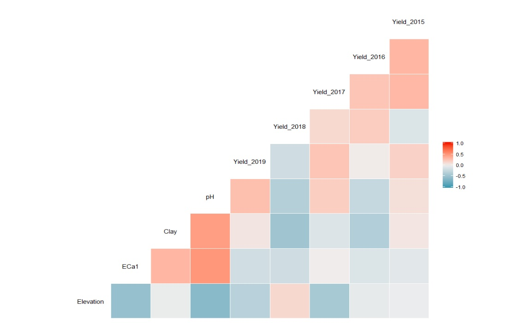

While canola yield in 2017 was better correlated with Elevation (positively affected in lower elevations, approximately below 175m), wheat yield in both 2016 and 2018 show higher correlation with % Clay (negatively affected by clay content above 43-45%). 

- Nielsen, D. R., & Alemi, M. H. (1989). Statistical opportunities for analyzing spatial and temporal heterogeneity of field soils. Plant and Soil, 115(2), 285-296.

Soil clay content was found to be the most representative parameter of wheat yield as also reported by Aschonitis et al. (2013). However the agronomic interpretation of high performing zone B is not straight forward. According to Ficher. (2011), the spatial patterns of wheat yield are unlikely to be correlated to mineral toxicity as the higher clay content zone (zone A) was the less productive one (Keren et al., 1985). Water-logging is also not likely to explain the differences in this case as the higher clay content zone is not located at the lowest elevations, and therefore, lateral drainage as well as superficial flow would be expected to occur. According to Hochman et al. (2009), we could expect lower yields in lower elevation zones due to saturation (zone C), but this was not observed. Different relations between evaporation and transpiration could be accepted if higher yield was observed in lower clay content zones (Wang et al., 2009), but this was also not the case. Comparable differences among clay-loamy and clay textured soils were described by Lithourgidis et al. (2006), but the proposed explanatory variable ECa, associated to salt dilution, varied in a larger range in comparison to our case-study. The range of spatial correlation for clay content when fitted into a variogram (i.e. Lag distance) equals approximately to 160m, which differs considerably from the same parameter for both 2016 and 2018 yield. This might indicate a weak spatial correlation between clay and yield. Additionally, the 'unbounded' structure of the 2018 variogram does not help to derive conclusions at this scale. 

- Aschonitis, V. G., Lithourgidis, A. S., Damalas, C. A., & Antonopoulos, V. Z. (2013). Modelling yields of non-irrigated winter wheat in a semi-arid mediterranean environment based on drought variability. Experimental agriculture, 49(3), 448-460.

- Fischer, R. A. (2011). Wheat physiology: a review of recent developments. Crop and Pasture Science, 62(2), 95-114.

- Keren, R., Bingham, F. T., & Rhoades, J. D. (1985). Effect of Clay Content in Soil on Boron Uptake and Yield of Wheat 1. Soil Science Society of America Journal, 49(6), 1466-1470.

- Lithourgidis, A. S., Damalas, C. A., & Gagianas, A. A. (2006). Long-term yield patterns for continuous winter wheat cropping in northern Greece. European Journal of Agronomy, 25(3), 208-214.

- Hochman, Z., Holzworth, D., & Hunt, J. R. (2009). Potential to improve on-farm wheat yield and WUE in Australia. Crop and Pasture Science, 60(8), 708-716.

- Wang, E., Cresswell, H., Xu, J., & Jiang, Q. (2009). Capacity of soils to buffer impact of climate variability and value of seasonal forecasts. Agricultural and Forest Meteorology, 149(1), 38-50.

For the case of sunflower, the medium level of water stress (29%) might partially explain the good correlation observed between yield and topography. Lower elevations (<175m) were more productive (zone C) while medium-high elevations yielded less. However, differences may be neglected as yields varied less than 1 ton/ha among MZ's. 

```{r}
# The goodness of variance fit (GVF)

#GVF for Yield 2015
SST = sum( (stats_data$Yield_2015 - mean(stats_data$Yield_2015) )^2 )
SSW_A = sum( (stats_data$Yield_2015[stats$ZONE == "A"] - mean(stats_data$Yield_2015[stats_data$ZONE == "A"]) )^2 )
SSW_B = sum( (stats_data$Yield_2015[stats$ZONE == "B"] - mean(stats_data$Yield_2015[stats_data$ZONE == "B"]) )^2 )
SSW_C = sum( (stats_data$Yield_2015[stats$ZONE == "C"] - mean(stats_data$Yield_2015[stats_data$ZONE == "C"]) )^2 )
SSW = SSW_A + SSW_B + SSW_C + SSW_D

GVF.2015 = (SST -SSW)/SST
GVF.2015

#GVF for Yield 2016
SST = sum( (stats_data$Yield_2016 - mean(stats_data$Yield_2016) )^2 )
SSW_A = sum( (stats_data$Yield_2016[stats$ZONE == "A"] - mean(stats_data$Yield_2016[stats_data$ZONE == "A"]) )^2 )
SSW_B = sum( (stats_data$Yield_2016[stats$ZONE == "B"] - mean(stats_data$Yield_2016[stats_data$ZONE == "B"]) )^2 )
SSW_C = sum( (stats_data$Yield_2016[stats$ZONE == "C"] - mean(stats_data$Yield_2016[stats_data$ZONE == "C"]) )^2 )
SSW = SSW_A + SSW_B + SSW_C + SSW_D

GVF.2016 = (SST -SSW)/SST
GVF.2016

#GVF for Yield 2017
SST = sum( (stats_data$Yield_2017 - mean(stats_data$Yield_2017) )^2 )
SSW_A = sum( (stats_data$Yield_2017[stats$ZONE == "A"] - mean(stats_data$Yield_2017[stats_data$ZONE == "A"]) )^2 )
SSW_B = sum( (stats_data$Yield_2017[stats$ZONE == "B"] - mean(stats_data$Yield_2017[stats_data$ZONE == "B"]) )^2 )
SSW_C = sum( (stats_data$Yield_2017[stats$ZONE == "C"] - mean(stats_data$Yield_2017[stats_data$ZONE == "C"]) )^2 )
SSW = SSW_A + SSW_B + SSW_C + SSW_D

GVF.2017 = (SST -SSW)/SST
GVF.2017

#GVF for Yield 2018
SST = sum( (stats_data$Yield_2018 - mean(stats_data$Yield_2018) )^2 )
SSW_A = sum( (stats_data$Yield_2018[stats$ZONE == "A"] - mean(stats_data$Yield_2018[stats_data$ZONE == "A"]) )^2 )
SSW_B = sum( (stats_data$Yield_2018[stats$ZONE == "B"] - mean(stats_data$Yield_2018[stats_data$ZONE == "B"]) )^2 )
SSW_C = sum( (stats_data$Yield_2018[stats$ZONE == "C"] - mean(stats_data$Yield_2018[stats_data$ZONE == "C"]) )^2 )
SSW = SSW_A + SSW_B + SSW_C + SSW_D

GVF.2018 = (SST -SSW)/SST
GVF.2018

#GVF for Yield 2019
SST = sum( (stats_data$Yield_2019 - mean(stats_data$Yield_2019) )^2 )
SSW_A = sum( (stats_data$Yield_2019[stats$ZONE == "A"] - mean(stats_data$Yield_2019[stats_data$ZONE == "A"]) )^2 )
SSW_B = sum( (stats_data$Yield_2019[stats$ZONE == "B"] - mean(stats_data$Yield_2019[stats_data$ZONE == "B"]) )^2 )
SSW_C = sum( (stats_data$Yield_2019[stats$ZONE == "C"] - mean(stats_data$Yield_2019[stats_data$ZONE == "C"]) )^2 )
SSW = SSW_A + SSW_B + SSW_C + SSW_D

GVF.2019 = (SST -SSW)/SST
GVF.209

```

|Year (Yield)| GVF |
|------------|-----|
|2015| 1% |
|2016| 27%|
|2017| 19% |
|2018| 23%|
|2019| 7%|

We may argue that each MZ is associated to a different combination of geophysical properties that results in different levels of productivity according to the *crop x year* setting. For spatial variable years (2016-2018), both zone A and C have shown consistency but the same cannot be said about zone B. As none of these three growing seasons seemed to be limitted by rainfall supply, we would argue that, in this particular case, crop species played a larger role on the spatial pattern response than year conditions. This observation hypothesizes that MZ delineation might achieve better persitence for perennial than annual crops. The year seemed to determine largely the degree of spatial variaton (GVF below 10% for both 2015 and 2019), while the crop species seemed to affect more the interpretation of yield association with MZ (similar GVF for the period 2016-2018 but different relative yields for the case of zone B). 

```{r}
# Time-series
rm(times_series)
times_series <- matrix(c(0.7733825,27.26609,19.40733,23.17392,7.479797),ncol=1,byrow = TRUE)

colnames(times_series) <- c("GVF %")
plot.ts(times_series)
```
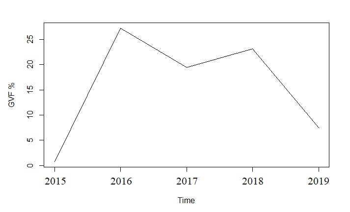

We observed differences, not only regarding yield patterns but also in yield response to the combination of geophysical properties depending on the crop species. For years with spatial variable yields, the ’Goodness of Variance Fit’ varied in comparable ranges but the performance of zone B differed considerably according to the crop species. The uncertainty associated with temporal asymmetry of yield clustering and MZ’s performance indicate that MZ’s temporal instability is an important issue for site-specific management as agronomic implications vary greatly with *crop × year* setting, being particularly relevant for crop rotations involving annual species. Other authors have concluded that the use of crop data on MZ delineation might add agronomic meaning to the clustering process under comparable conditions, but the temporal inconsistency of yield patterns might constrain their application for different conditions. 

- Godwin, R. J., Wood, G. A., Taylor, J. C., Knight, S. M., & Welsh, J. P. (2003). Precision farming of cereal crops: a review of a six year experiment to develop management guidelines. Biosystems Engineering, 84(4), 375-391.

- Khosla, R., Westfall, D. G., Reich, R. M., Mahal, J. S., & Gangloff, W. J. (2010). Spatial variation and site-specific management zones. In Geostatistical applications for precision agriculture (195-219). Springer.

- Welsh, J. P., Wood, G. A., Godwin, R. J., Taylor, J. C., Earl, R., Blackmore, S., & Knight, S. M. (2003). Developing strategies for spatially variable nitrogen application in cereals, part II: wheat. Biosystems Engineering, 84(4), 495-511.

- Yamagishi, J., Nakamoto, T., & Richner, W. (2003). Stability of spatial variability of wheat and maize biomass in a small field managed under two contrasting tillage systems over 3 years. Field crops research, 81(2-3), 95-108.

The lack of temporal stability and the weak spatial correlations between MZ's and yield (low and usatble GVF values), indicate that the delineation of pre-sowing (or pre-emergence) site-specific management, purely based on data analytics applied to historical spatial variability, is a dificult task.
