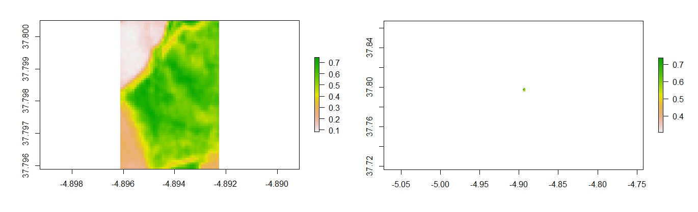
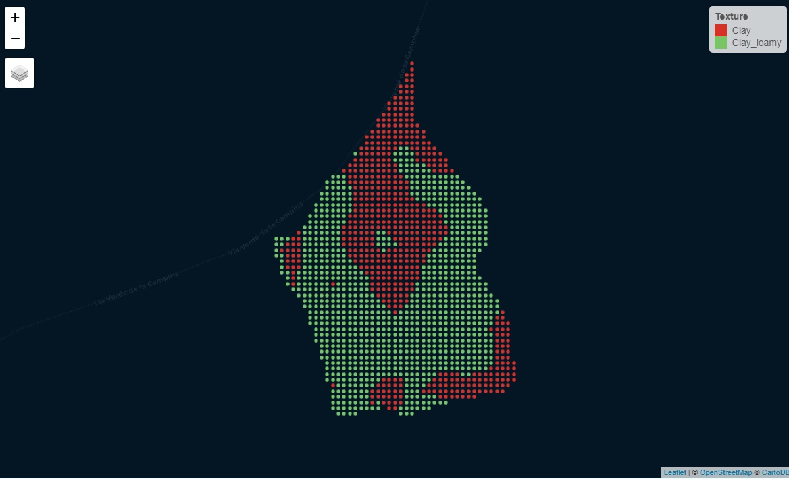
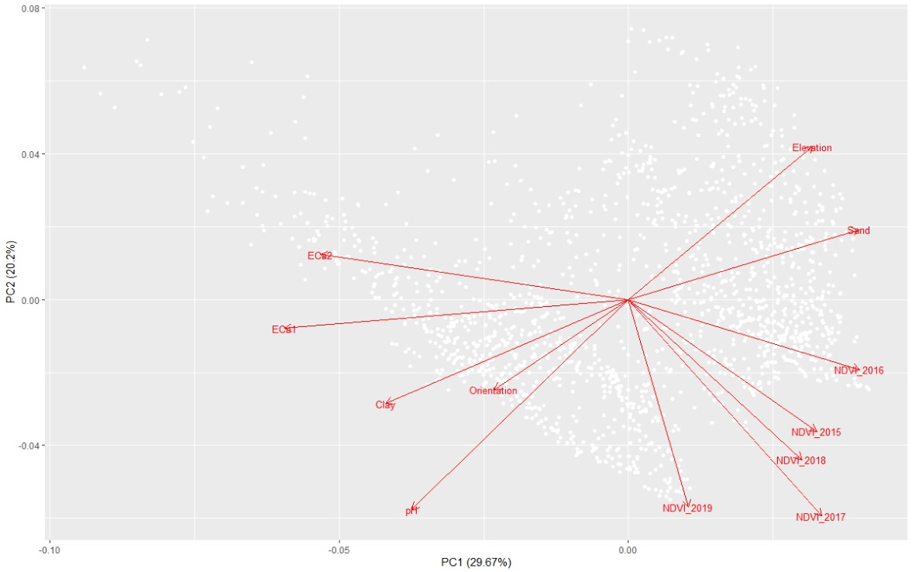

# Uncertainties associated with the delineation of management zones in precision agriculture


> Author: Tomás Roquette Tenreiro

> Institute for Sustainable Agriculture (IAS-CSIC) - Córdoba, 2020

## 1. First steps
### 1.1 R-Markdown script

This is an R-Markdown script presentation. R-Markdown is a simple formatting syntax for authoring HTML, PDF, and MS Word documents. For more details on using R-Markdown see <http://rmarkdown.rstudio.com>. This document includes both general instructions and comments by the author as well as the script code developed and the output of any embedded R code chunks within this document.

### 1.2 General introduction

The following R-script aims to describe an analytical procedure that combined multiple spatial data in order to delineate management zones for sampling and soil moisture probe installation. The main goal is to distinguish management zones based on geo-physical (i.e. orientation, elevation, texture, ECa), chemical (pH), and biological (plant vigor) properties within a crop field. The selected field is about 9.5 ha, located in the arable region of Cordoba. This document aims also to deliver a script that can be adjusted to similar analyses or function as a guide to conduct geospatial analysis with R. The reader can use this document both as a dissemination and a decision supporting tool.

### 1.3 Necessary material - R libraries    

The first step consists on installing all necessary libraries for this analysis: 

```{r}
install.packages("rmarkdown")
install.packages("dplyr")
install.packages("plyr")
install.packages("reshape2")
install.packages("agricolae")
install.packages("quantreg")
install.packages("ploty")
install.packages("sf")
install.packages("raster")
install.packages("spData")
install.packages('spDataLarge', repos='https://nowosad.github.io/drat/', type='source')
install.packages("gridExtra")
install.packages("RColorBrewer")
install.packages("root.dir")
install.packages("tidyverse")
install.packages("ggplot2")
install.packages("wesanderson")
install.packages("ggpmisc")
install.packages("knitr")
install.packages("installr")
install.packages("lmtest", repos = "http://cran.us.r-project.org")
install.packages("tinytex")
```
and updating all the installed libraries in R-studio.

```{r}
library(knitr)
library(sf)
library(dplyr)  
library(plyr)
library(reshape2)
library(agricolae)
library(quantreg)
library(plotly)
library(sp)
library(spDataLarge)
library(spData)
library(tmap)
library(raster)
library(gridExtra)
library(quantreg)
library(ggplot2)
library(RColorBrewer)
library(tidyverse)
library(gridExtra)
library(wesanderson)
library(ggpmisc)
library(markdown)
library(tinytex)
library(lmtest)
```

### 1.4 Initial details - working directory

In this section we set initial details to specify the working directory; in this particular case the analysis was linked to the internal folder "Experimental_Catchment_Cordoba_19_20" where input and output data is saved. To run this code please specify the working directory where your input files are saved. 

```{r setup, include=FALSE}
rm(list=ls())
getwd()
knitr::opts_chunk$set(echo = TRUE)
knitr::opts_knit$set(root.dir = "C:/Users/Tomas R. Tenreiro/Desktop/Experimental_Catchment_Cordoba_19_20")
```

## 2 Historical remote sensing data

### 1.1 Input material

This section uploads all input material. In this particular case, we will work with satellite data (Landsat-8 and Sentinel-2), atmospherically corrected (and cloud cover < 4%), that was downloaded from EO-browser (https://apps.sentinel-hub.com/). The script considers imagery from five different growing seasons (i.e. 2015, 2016, 2017, 2018 and 2019). In order to explore spatial correlation between plant vigor and soil properties under rainfed conditions, we focused on late phenological stages before crop senescence. The two consecutive images taken imediatly after flowering stage were selected for each year. 2015 and 2017 imagery corresponds to a sunflower crop, 2016 and 2018 to a winter wheat crop and 2019 imagery corresponds to a canola crop. 

| Year | Crop             | Date 1     | Date 2     | Satellite   | Sp.Resolution |
|------|------------------|------------|------------|-------------|---------------|
| 2015 | Sunflower        | 05/6/2015  | 07/7/2015  | Landsat-8   | 30x30 m       |
| 2016 | Wheat (durum)    | 07/6/2016  | 23/6/2016  | Landsat-8   | 30x30 m       |
| 2017 | Sunflower        | 10/6/2017  | 26/6/2017  | Landsat-8   | 30x30 m       |
| 2018 | Wheat (durum)    | 22/5/2018  | 03/6/2018  | Sentinel-2  | 10x10 m       |
| 2019 | Canola           | 14/4/2019  | 27/4/2019  | Sentinel-2  | 10x10 m       |

```{r}
# Date 2015 -1
Red.2015.1 <- raster("SAT Imagery/Red_05.06.2015.tiff")
NIR.2015.1 <- raster("SAT Imagery/NIR_05.06.2015.tiff")

# Date 2015 -2
Red.2015.2 <- raster("SAT Imagery/Red_07.07.2015.tiff")
NIR.2015.2 <- raster("SAT Imagery/NIR_07.07.2015.tiff")

# Date 2016 -1
Red.2016.1 <- raster("SAT Imagery/Red_07.06.2016.tiff")
NIR.2016.1 <- raster("SAT Imagery/NIR_07.06.2016.tiff")

# Date 2016 -2
Red.2016.2 <- raster("SAT Imagery/Red_23.06.2016.tiff")
NIR.2016.2 <- raster("SAT Imagery/NIR_23.06.2016.tiff")

# Date 2017 -1
Red.2017.1 <- raster("SAT Imagery/Red_10.06.2017.tiff")
NIR.2017.1 <- raster("SAT Imagery/NIR_10.06.2017.tiff")

# Date 2017 -2
Red.2017.2 <- raster("SAT Imagery/Red_26.06.2017.tiff")
NIR.2017.2 <- raster("SAT Imagery/NIR_26.06.2017.tiff")

# Date 2018 -1
Red.2018.1 <- raster("SAT Imagery/Red_22.05.2018.tiff")
NIR.2018.1 <- raster("SAT Imagery/NIR_22.05.2018.tiff")

# Date 2018 -2
Red.2018.2 <- raster("SAT Imagery/Red_03.06.2018.tiff")
NIR.2018.2 <- raster("SAT Imagery/NIR_03.06.2018.tiff")

# Date 2019 -1
Red.2019.1 <- raster("SAT Imagery/Red_14.04.2019.tiff")
NIR.2019.1 <- raster("SAT Imagery/NIR_14.04.2019.tiff")

# Date 2019 -2
Red.2019.2 <- raster("SAT Imagery/Red_27.04.2019.tiff")
NIR.2019.2 <- raster("SAT Imagery/NIR_27.04.2019.tiff")
```

### 2.2 Estimate NDVI 

This section estimates NDVI considering that Landsat-8 satellite B4 corresponds to Red wave length and B5 to NIR wave length; Sentinel-2 satellite B4 corresponds to Red wave length and B8 to NIR wave length. Data is in raster format with a spatial resolution of 30x30m (Landsat-8) or 10x10m (Sentinel-2).

```{r}
# NDVI 2015
NDVI_2015.1 <- (NIR.2015.1 - Red.2015.1) / (NIR.2015.1 + Red.2015.1)
NDVI_2015.2 <- (NIR.2015.2 - Red.2015.2) / (NIR.2015.2 + Red.2015.2)

# NDVI 2016
NDVI_2016.1 <- (NIR.2016.1 - Red.2016.1) / (NIR.2016.1 + Red.2016.1)
NDVI_2016.2 <- (NIR.2016.2 - Red.2016.2) / (NIR.2016.2 + Red.2016.2)

# NDVI 2017
NDVI_2017.1 <- (NIR.2017.1 - Red.2017.1) / (NIR.2017.1 + Red.2017.1)
NDVI_2017.2 <- (NIR.2017.2 - Red.2017.2) / (NIR.2017.2 + Red.2017.2)

# NDVI 2018
NDVI_2018.1 <- (NIR.2018.1 - Red.2018.1) / (NIR.2018.1 + Red.2018.1)
NDVI_2018.2 <- (NIR.2018.2 - Red.2018.2) / (NIR.2018.2 + Red.2018.2)

# NDVI 2019
NDVI_2019.1 <- (NIR.2019.1 - Red.2019.1) / (NIR.2019.1 + Red.2019.1)
NDVI_2019.2 <- (NIR.2019.2 - Red.2019.2) / (NIR.2019.2 + Red.2019.2)
```

### 2.3 Create maps of NDVI 

Here we create maps of NDVI with 'tm_shape' function applied to raster data (tm_raster). It is important to make sure that we have uploaded the library 'tmap';

```{r}
# Map NDVI 2015
NDVI_2015.1_map <- tm_shape(NDVI_2015.1) + tm_raster(palette="YlGn",n=5) + tm_legend(outside = TRUE, text.size = 1.2)
NDVI_2015.2_map <- tm_shape(NDVI_2015.2) + tm_raster(palette="YlGn",n=5) + tm_legend(outside = TRUE, text.size = 1.2)

# Map NDVI 2016
NDVI_2016.1_map <- tm_shape(NDVI_2016.1) + tm_raster(palette="YlGn",n=5) + tm_legend(outside = TRUE, text.size = 1.2)
NDVI_2016.2_map <- tm_shape(NDVI_2016.2) + tm_raster(palette="YlGn",n=5) + tm_legend(outside = TRUE, text.size = 1.2)

# Map NDVI 2017
NDVI_2017.1_map <- tm_shape(NDVI_2017.1) + tm_raster(palette="YlGn",n=5) + tm_legend(outside = TRUE, text.size = 1.2)
NDVI_2017.2_map <- tm_shape(NDVI_2017.2) + tm_raster(palette="YlGn",n=5) + tm_legend(outside = TRUE, text.size = 1.2)

# Map NDVI 2016
NDVI_2018.1_map <- tm_shape(NDVI_2018.1) + tm_raster(palette="YlGn",n=5) + tm_legend(outside = TRUE, text.size = 1.2)
NDVI_2018.2_map <- tm_shape(NDVI_2018.2) + tm_raster(palette="YlGn",n=5) + tm_legend(outside = TRUE, text.size = 1.2)

# Map NDVI 2017
NDVI_2019.1_map <- tm_shape(NDVI_2019.1) + tm_raster(palette="YlGn",n=5) + tm_legend(outside = TRUE, text.size = 1.2)
NDVI_2019.2_map <- tm_shape(NDVI_2019.2) + tm_raster(palette="YlGn",n=5) + tm_legend(outside = TRUE, text.size = 1.2)
```

### 2.4 Visualize NDVI raster maps 

First for 2015 ('ncol' means the number of columns up to a maximum limit of 4 features):

```{r}
tmap_arrange(NDVI_2015.1_map, 
             NDVI_2015.2_map, 
             ncol=2)
```


For the remaining years:

```{r}
# 2016
tmap_arrange(NDVI_2016.1_map, 
             NDVI_2016.2_map, 
             ncol=2)
             
# 2017
tmap_arrange(NDVI_2017.1_map, 
             NDVI_2017.2_map, 
             ncol=2)
             
# 2018
tmap_arrange(NDVI_2018.1_map, 
             NDVI_2018.2_map, 
             ncol=2)

# 2019
tmap_arrange(NDVI_2019.1_map, 
             NDVI_2019.2_map, 
             ncol=2)
```

### 2.5 Upload the field vector for clip operations

The field vector selected should be the shapefile polygon of the field. In this particular case, the shapefile was obtained with QGIS considering a topographic characterization of the selected catchment. The catchment was spatially defined according to a map of flow directions (raster) obtained with the SAGA - Wang & Liu algorithm. The algorithm defines water flow and hillshades orientation in a particular area of interest from a DEM. We used a DEM with 5m spatial resolution obtained with LiDAR from CNIG (http://centrodedescargas.cnig.es/CentroDescargas/index.jsp). From that information, a catchment was isolated with an area of approximately 9.5 ha.

```{r}
# Upload field vector
field_vector <- st_read("sentinel/R_analysis/Field_vector.shp")
plot (field_vector$geometry)
```


In this step it is also important to check whether the coordinate system is the same as of satellite imagery; in this particular case we will work with the system WGS84 EPSG 4326. [1] "+proj=longlat +datum=WGS84 +no_defs" CRS arguments: +proj=longlat +datum=WGS84 +no_defs +ellps=WGS84 +towgs84=0,0,0 

```{r}
# Check coordinate system
crs(field_vector)
crs(NDVI_2016.1) # as an example to check coordinate system of rasters
```

### 2.6 Cropping and Masking tools

In the following section the script crops and masks the NDVI maps by the field vector shapefile. For more info about these functions please check the outcome and have a look at the following link "https://rpubs.com/ricardo_ochoa/416711"

```{r}
# Crop NDVI data 2015
cropped_feature_2015.1 = crop(NDVI_2015.1, field_vector)
plot (cropped_feature_2015.1)
cropped_feature_2015.2 = crop(NDVI_2015.2, field_vector)
plot (cropped_feature_2015.2)

# Mask NDVI data 2015
masked_feature_2015.1 = mask(NDVI_2015.1, field_vector)
plot(masked_feature_2015.1)
masked_feature_2015.2 = mask(NDVI_2015.2, field_vector)
plot(masked_feature_2015.2)

# Crop NDVI data 2016
cropped_feature_2016.1 = crop(NDVI_2016.1, field_vector)
plot (cropped_feature_2016.1)
cropped_feature_2016.2 = crop(NDVI_2016.2, field_vector)
plot (cropped_feature_2016.2)

# Mask NDVI data 2016
masked_feature_2016.1 = mask(NDVI_2016.1, field_vector)
plot(masked_feature_2016.1)
masked_feature_2016.2 = mask(NDVI_2016.2, field_vector)
plot(masked_feature_2016.2)

# Crop NDVI data 2017
cropped_feature_2017.1 = crop(NDVI_2017.1, field_vector)
plot (cropped_feature_2017.1)
cropped_feature_2017.2 = crop(NDVI_2017.2, field_vector)
plot (cropped_feature_2017.2)

# Mask NDVI data 2017
masked_feature_2017.1 = mask(NDVI_2017.1, field_vector)
plot(masked_feature_2017.1)
masked_feature_2017.2 = mask(NDVI_2017.2, field_vector)
plot(masked_feature_2017.2)

# Crop NDVI data 2018
cropped_feature_2018.1 = crop(NDVI_2018.1, field_vector)
plot (cropped_feature_2018.1)
cropped_feature_2018.2 = crop(NDVI_2018.2, field_vector)
plot (cropped_feature_2018.2)

# Mask NDVI data 2018
masked_feature_2018.1 = mask(NDVI_2018.1, field_vector)
plot(masked_feature_2018.1)
masked_feature_2018.2 = mask(NDVI_2018.2, field_vector)
plot(masked_feature_2018.2)

# Crop NDVI data 2019
cropped_feature_2019.1 = crop(NDVI_2019.1, field_vector)
plot (cropped_feature_2019.1)
cropped_feature_2019.2 = crop(NDVI_2019.2, field_vector)
plot (cropped_feature_2019.2)

# Mask NDVI data 2019
masked_feature_2019.1 = mask(NDVI_2019.1, field_vector)
plot(masked_feature_2019.1)
masked_feature_2019.2 = mask(NDVI_2019.2, field_vector)
plot(masked_feature_2019.2)
```
As an example, the following two figures represent respectively, from left to right, a crop feature and a mask feature, both obtained from 2019.2 satellite imagery:



### 2.7 Visualization mode: Interactive (view) vs. Static (plot) viewing 

Here we provide the basic comand to select interactive (or static) viewing mode of outcomes. 
If you want to get back to the "static" mode please switch 'view' by 'plot' in the function term 'tmap_mode()'

```{r}
tmap_mode("view") 
# or tmap_mode("plot") instead
```

### 2.8 Interactive mapping of masked NDVI rasters

To define the maps:

```{r}
# For 2015
masked_2015.1 <- tm_shape(masked_feature_2015.1) + tm_raster(palette="YlGn",n=10, title="NDVI_05.06.2015") + tm_legend(outside = TRUE, text.size = 1.2)
masked_2015.2 <- tm_shape(masked_feature_2015.2) + tm_raster(palette="YlGn",n=10, title="NDVI_07.07.2015") + tm_legend(outside = TRUE, text.size = 1.2)

# For 2016
masked_2016.1 <- tm_shape(masked_feature_2016.1) + tm_raster(palette="YlGn",n=10, title="NDVI_07.06.2016") + tm_legend(outside = TRUE, text.size = 1.2)
masked_2016.2 <- tm_shape(masked_feature_2016.2) + tm_raster(palette="YlGn",n=10, title="NDVI_23.06.2016") + tm_legend(outside = TRUE, text.size = 1.2)

# For 2017
masked_2017.1 <- tm_shape(masked_feature_2017.1) + tm_raster(palette="YlGn",n=10, title="NDVI_10.06.2017") + tm_legend(outside = TRUE, text.size = 1.2)
masked_2017.2 <- tm_shape(masked_feature_2017.2) + tm_raster(palette="YlGn",n=10, title="NDVI_26.06.2017") + tm_legend(outside = TRUE, text.size = 1.2)

# For 2018
masked_2018.1 <- tm_shape(masked_feature_2018.1) + tm_raster(palette="YlGn",n=10, title="NDVI_22.05.2018") + tm_legend(outside = TRUE, text.size = 1.2)
masked_2018.2 <- tm_shape(masked_feature_2018.2) + tm_raster(palette="YlGn",n=10, title="NDVI_03.06.2018") + tm_legend(outside = TRUE, text.size = 1.2)

# For 2019
masked_2019.1 <- tm_shape(masked_feature_2019.1) + tm_raster(palette="YlGn",n=10, title="NDVI_14.04.2019") + tm_legend(outside = TRUE, text.size = 1.2)
masked_2019.2 <- tm_shape(masked_feature_2019.2) + tm_raster(palette="YlGn",n=10, title="NDVI_27.04.2019") + tm_legend(outside = TRUE, text.size = 1.2)
```

To print them:

```{r}
# For 2015
tmap_arrange(masked_2015.1,
             masked_2015.2,
             ncol=2)
# For 2016             
tmap_arrange(masked_2016.1,
             masked_2016.2,
             ncol=2)
# For 2017             
tmap_arrange(masked_2017.1,
             masked_2017.2,
             ncol=2)
# For 2018
tmap_arrange(masked_2018.1,
             masked_2018.2,
             ncol=2) 
# For 2019
tmap_arrange(masked_2019.1,
             masked_2019.2,
             ncol=2)
```

As an example, check the outcome for 2019:


Which can be (interactively) zoomed in: 


### 2.9 Display facets 

1) We convert raster data into vectorial point-based data while keeping the same (Landsat-8/Sentinel-2) spatial resolution (30x30m/10x10m). 

2) Use of 'tmap_arrange' to display facets for NDVI vectorial mapping.

```{r}
# From raster to point 2015
NDVI_vector_2015.1 <- rasterToPoints(masked_feature_2015.1, spatial = TRUE) %>% st_as_sf()
NDVI_vector_2015.2 <- rasterToPoints(masked_feature_2015.2, spatial = TRUE) %>% st_as_sf()

# Correct feature name
names(NDVI_vector_2015.1)[names(NDVI_vector_2015.1) == "layer"] <- "NDVI_2015.1"
names(NDVI_vector_2015.2)[names(NDVI_vector_2015.2) == "layer"] <- "NDVI_2015.2"

# Create maps for 2015
NDVI_points_2015.1 <- tm_shape(NDVI_vector_2015.1) + tm_dots(col="NDVI_2015.1", palette="YlGn", n=10) + tm_style("cobalt") + 
tm_legend(outside = TRUE, text.size = 1.2)
NDVI_points_2015.2 <- tm_shape(NDVI_vector_2015.2) + tm_dots(col="NDVI_2015.2", palette="YlGn", n=10) + tm_style("cobalt") + 
  tm_legend(outside = TRUE, text.size = 1.2)

# Display facets
tmap_arrange(NDVI_points_2015.1,
             NDVI_points_2015.2,
             ncol=2)
             
# From raster to point 2016
NDVI_vector_2016.1 <- rasterToPoints(masked_feature_2016.1, spatial = TRUE) %>% st_as_sf()
NDVI_vector_2016.2 <- rasterToPoints(masked_feature_2016.2, spatial = TRUE) %>% st_as_sf()

# Correct feature name
names(NDVI_vector_2016.1)[names(NDVI_vector_2016.1) == "layer"] <- "NDVI_2016.1"
names(NDVI_vector_2016.2)[names(NDVI_vector_2016.2) == "layer"] <- "NDVI_2016.2"

# Create maps for 2016
NDVI_points_2016.1 <- tm_shape(NDVI_vector_2016.1) + tm_dots(col="NDVI_2016.1", palette="YlGn", n=10) + tm_style("cobalt") + 
tm_legend(outside = TRUE, text.size = 1.2)
NDVI_points_2016.2 <- tm_shape(NDVI_vector_2016.2) + tm_dots(col="NDVI_2016.2", palette="YlGn", n=10) + tm_style("cobalt") + 
  tm_legend(outside = TRUE, text.size = 1.2)

# Display facets
tmap_arrange(NDVI_points_2016.1,
             NDVI_points_2016.2,
             ncol=2)

# From raster to point 2017
NDVI_vector_2017.1 <- rasterToPoints(masked_feature_2017.1, spatial = TRUE) %>% st_as_sf()
NDVI_vector_2017.2 <- rasterToPoints(masked_feature_2017.2, spatial = TRUE) %>% st_as_sf()

# Correct feature name
names(NDVI_vector_2017.1)[names(NDVI_vector_2017.1) == "layer"] <- "NDVI_2017.1"
names(NDVI_vector_2017.2)[names(NDVI_vector_2017.2) == "layer"] <- "NDVI_2017.2"

# Create maps for 2017
NDVI_points_2017.1 <- tm_shape(NDVI_vector_2017.1) + tm_dots(col="NDVI_2017.1", palette="YlGn", n=10) + tm_style("cobalt") + 
tm_legend(outside = TRUE, text.size = 1.2)
NDVI_points_2017.2 <- tm_shape(NDVI_vector_2017.2) + tm_dots(col="NDVI_2017.2", palette="YlGn", n=10) + tm_style("cobalt") + 
  tm_legend(outside = TRUE, text.size = 1.2)

# Display facets
tmap_arrange(NDVI_points_2017.1,
             NDVI_points_2017.2,
             ncol=2)

# From raster to point 2018
NDVI_vector_2018.1 <- rasterToPoints(masked_feature_2018.1, spatial = TRUE) %>% st_as_sf()
NDVI_vector_2018.2 <- rasterToPoints(masked_feature_2018.2, spatial = TRUE) %>% st_as_sf()

# Correct feature name
names(NDVI_vector_2018.1)[names(NDVI_vector_2018.1) == "layer"] <- "NDVI_2018.1"
names(NDVI_vector_2018.2)[names(NDVI_vector_2018.2) == "layer"] <- "NDVI_2018.2"

# Create maps for 2018
NDVI_points_2018.1 <- tm_shape(NDVI_vector_2018.1) + tm_dots(col="NDVI_2018.1", palette="YlGn", n=10) + tm_style("cobalt") + 
tm_legend(outside = TRUE, text.size = 1.2)
NDVI_points_2018.2 <- tm_shape(NDVI_vector_2018.2) + tm_dots(col="NDVI_2018.2", palette="YlGn", n=10) + tm_style("cobalt") + 
  tm_legend(outside = TRUE, text.size = 1.2)

# Display facets
tmap_arrange(NDVI_points_2018.1,
             NDVI_points_2018.2,
             ncol=2)

# From raster to point 2019
NDVI_vector_2019.1 <- rasterToPoints(masked_feature_2019.1, spatial = TRUE) %>% st_as_sf()
NDVI_vector_2019.2 <- rasterToPoints(masked_feature_2019.2, spatial = TRUE) %>% st_as_sf()

# Correct feature name
names(NDVI_vector_2019.1)[names(NDVI_vector_2019.1) == "layer"] <- "NDVI_2019.1"
names(NDVI_vector_2019.2)[names(NDVI_vector_2019.2) == "layer"] <- "NDVI_2019.2"

# Create maps for 2019
NDVI_points_2019.1 <- tm_shape(NDVI_vector_2019.1) + tm_dots(col="NDVI_2019.1", palette="YlGn", n=10) + tm_style("cobalt") + 
tm_legend(outside = TRUE, text.size = 1.2)
NDVI_points_2019.2 <- tm_shape(NDVI_vector_2019.2) + tm_dots(col="NDVI_2019.2", palette="YlGn", n=10) + tm_style("cobalt") + 
  tm_legend(outside = TRUE, text.size = 1.2)

# Display facets
tmap_arrange(NDVI_points_2019.1,
             NDVI_points_2019.2,
             ncol=2)
```


## 3 Geo-spatial analysis of field data

### 3.1 Display sampling and ECa measuring photos

Some photos of the measures taken with a Dualem sensor (i.e. electromagnetic induction sensor), spatial resolution of 1x15m. Soil ECa was measured at 35 and 85 cm depth before sowing and a few days after a rainfall event of aprox. 10 mm. Soil samples were also collected to estimate pH and clay content. 

For more info in regard to ECa sensing/mapping please read:

- Johnson, C. K., Doran, J. W., Duke, H. R., Wienhold, B. J., Eskridge, K. M., & Shanahan, J. F. (2001). Field-scale electrical conductivity mapping for delineating soil condition. Soil Science Society of America Journal, 65(6), 1829-1837.

- McCutcheon, M. C., Farahani, H. J., Stednick, J. D., Buchleiter, G. W., & Green, T. R. (2006). Effect of soil water on apparent soil electrical conductivity and texture relationships in a dryland field. Biosystems Engineering, 94(1), 19-32.

```{r}
# Upload libraries 'imager' and 'png'
library(knitr)    # For knitting document and include_graphics function
library(ggplot2)  # For plotting
library(png)      # For grabbing the dimensions of png files

#Define file ath
img1_path <- "sentinel/R_analysis/Pictures_Sampling/1.png"
img2_path <- "sentinel/R_analysis/Pictures_Sampling/2.png"
img3_path <- "sentinel/R_analysis/Pictures_Sampling/3.png"
img4_path <- "sentinel/R_analysis/Pictures_Sampling/4.png"
img5_path <- "sentinel/R_analysis/Pictures_Sampling/3.png"
img6_path <- "sentinel/R_analysis/Pictures_Sampling/4.png"

# Display pictures
include_graphics(img1_path) 
include_graphics(img2_path) 
include_graphics(img3_path) 
include_graphics(img4_path) 
include_graphics(img5_path) 
include_graphics(img6_path) 
```


### 3.2 Upload soil physical and chemical data 

Data collected at 10th October 2019 
Field location: Guadálcazar, Córdoba, Spain

Four different types of properties:
1) Soil texture (%Clay, %Sand);
2) Soil ECa (35 and 85 cm depth);
3) Slope orientation;
4) Elevation (m);

```{r}
# Upload raster data
GF_Elevation     <- raster("GF_Elevation.tif")
GF_Orientation   <- raster("GF_Orientation.tif")
GF_ECa1          <- raster("GF_CEa1.tif")
GF_ECa2          <- raster("GF_CEa2.tif")

# Convert to point vectorial data
GF_Elevation_dots <- rasterToPoints(GF_Elevation, spatial = TRUE) %>% st_as_sf()
names(GF_Elevation_dots)[names(GF_Elevation_dots) == "GF_Elevation"] <- "Elevation"
GF_Orientation_dots <- rasterToPoints(GF_Orientation, spatial = TRUE) %>% st_as_sf()
names(GF_Orientation_dots)[names(GF_Orientation_dots) == "GF_Orientation"] <- "Orientation"
GF_ECa1_dots <- rasterToPoints(GF_ECa1, spatial = TRUE) %>% st_as_sf()
names(GF_ECa1_dots)[names(GF_ECa1_dots) == "GF_CEa1"] <- "ECa1"
GF_ECa2_dots <- rasterToPoints(GF_ECa2, spatial = TRUE) %>% st_as_sf()
names(GF_ECa2_dots)[names(GF_ECa2_dots) == "GF_CEa2"] <- "ECa2"
```

## 3.3. Join field data and NDVI data on a single shapefile

Here we run a spatial join in order to build a single shapefile containing point based data (10x10m) with plant vigor (NDVI), soil physical properties (elevation, orientation, ECa, texture) and chemical data (pH).

```{r}
# Start spatial join (NDVI + Elevation + Orientation + ECa)
rm(MZ_joined)
MZ_joined = st_join(NDVI_vector_2019.1, NDVI_vector_2019.2["NDVI_2019.2"], join = st_nearest_feature)

MZ_joined = st_join(MZ_joined, NDVI_vector_2018.1["NDVI_2018.1"], join = st_nearest_feature)
MZ_joined = st_join(MZ_joined, NDVI_vector_2018.2["NDVI_2018.2"], join = st_nearest_feature)
MZ_joined = st_join(MZ_joined, NDVI_vector_2017.1["NDVI_2017.1"], join = st_nearest_feature)
MZ_joined = st_join(MZ_joined, NDVI_vector_2017.2["NDVI_2017.2"], join = st_nearest_feature)
MZ_joined = st_join(MZ_joined, NDVI_vector_2016.1["NDVI_2016.1"], join = st_nearest_feature)
MZ_joined = st_join(MZ_joined, NDVI_vector_2016.2["NDVI_2016.2"], join = st_nearest_feature)
MZ_joined = st_join(MZ_joined, NDVI_vector_2015.1["NDVI_2015.1"], join = st_nearest_feature)
MZ_joined = st_join(MZ_joined, NDVI_vector_2015.2["NDVI_2015.2"], join = st_nearest_feature)

MZ_joined = st_join(MZ_joined, GF_Elevation_dots["Elevation"], join = st_nearest_feature)
MZ_joined = st_join(MZ_joined, GF_Orientation_dots["Orientation"], join = st_nearest_feature)
MZ_joined = st_join(MZ_joined, GF_ECa1_dots["ECa1"], join = st_nearest_feature)
MZ_joined = st_join(MZ_joined, GF_ECa2_dots["ECa2"], join = st_nearest_feature)

# Convert Eca from mS/m to dS/m and estimate ECa mean
MZ_joined$ECa1     <- MZ_joined$ECa1/100
MZ_joined$ECa2     <- MZ_joined$ECa2/100
MZ_joined$EC_mean  <- ((MZ_joined$ECa1+MZ_joined$ECa2)/2)

# A simple classification of soil texture proposed by Greenfields: http://www.greenfield.agrodrone.es/ 
MZ_joined$Texture  <- "Clay_loamy"
MZ_joined$Texture[MZ_joined$ECa2 > 0.60]  <- "Clay"
MZ_joined$Texture[MZ_joined$ECa1 < 0.10]  <- "Clay_loamy"
tm_shape(MZ_joined) + tm_dots(col = "Texture", palette = "RdYlGn", n=2) + tm_style("cobalt")
```
 

### 3.4 Soil sampling for pH and %clay mapping

A total of 10 soil samples were collected at 40cm according to a clustering of ECa. Data is spatially interpolated following a 'nearest-feature' algorithm in order to produce point based vectorial maps with the same spatial resolution of MZ_joined.  

```{r}
# Upload sampling dots
Sampling_vector <- st_read("Sampling_dots.shp")
Sampling_map    <- tm_shape(Sampling_vector) + tm_dots(col = "green", palette = "RdYlGn", n=6) + tm_style("cobalt")
Sampling_map  

# Rename: translating from Spanish to English
names(Sampling_vector)[names(Sampling_vector) == "ARCILLA"] <- "Clay"
names(Sampling_vector)[names(Sampling_vector) == "PH"] <- "pH"
names(Sampling_vector)[names(Sampling_vector) == "ARENA"] <- "Sand"
```

A few sampling photos

```{r}
#Define file path
img7_path <- "sentinel/R_analysis/Pictures_Sampling/7.png"
img8_path <- "sentinel/R_analysis/Pictures_Sampling/8.png"

# Display pictures
include_graphics(img7_path) 
include_graphics(img8_path) 
```


```{r}
# Spatial join
MZ_joined = st_join(MZ_joined, Sampling_vector["Clay"], join = st_nearest_feature)
MZ_joined = st_join(MZ_joined, Sampling_vector["pH"], join = st_nearest_feature)
MZ_joined = st_join(MZ_joined, Sampling_vector["Sand"], join = st_nearest_feature)

# Map sampling points
Clay_map <- tm_shape(MZ_joined) + tm_dots(col = "Clay", palette = "YlOrBr", n=8, size = 0.3) #+ tm_style("cobalt") 
Sand_map <- tm_shape(MZ_joined) + tm_dots(col = "Sand", palette = "Oranges", n=8, size = 0.3) #+ tm_style("cobalt") 
pH_map   <- tm_shape(MZ_joined) + tm_dots(col = "pH", palette = "Blues", n=5, size = 0.3) #+ tm_style("cobalt")

# Display
tmap_mode("plot") 
tmap_arrange(Clay_map,
             Sand_map,
             pH_map,
             ncol=3)
```


### 3.5 Descriptive statistics - coefficient of variation (CV)

```{r}
# Estimate CV
cv_Clay      = cv(MZ_joined$Clay)
cv_Sand      = cv(MZ_joined$Sand)
cv_pH        = cv(MZ_joined$pH)

cv_ECa1      = cv(MZ_joined$ECa1)
cv_ECa2      = cv(MZ_joined$ECa2)
cv_O         = cv(MZ_joined$Orientation)
cv_E         = cv(MZ_joined$Elevation)

cv_NDVI_2019.1 = cv(MZ_joined$NDVI_2019.1)
cv_NDVI_2019.2 = cv(MZ_joined$NDVI_2019.2)
cv_NDVI_2018.1 = cv(MZ_joined$NDVI_2018.1)
cv_NDVI_2018.2 = cv(MZ_joined$NDVI_2018.2)
cv_NDVI_2017.1 = cv(MZ_joined$NDVI_2017.1)
cv_NDVI_2017.2 = cv(MZ_joined$NDVI_2017.2)
cv_NDVI_2016.1 = cv(MZ_joined$NDVI_2016.1)
cv_NDVI_2016.2 = cv(MZ_joined$NDVI_2016.2)
cv_NDVI_2015.1 = cv(MZ_joined$NDVI_2015.1)
cv_NDVI_2015.2 = cv(MZ_joined$NDVI_2015.2)
```

Printed results:

| Variable | CV|
|----------|---|
|Clay   | 6.65%|
|Sand| 25.97%|
|pH | 3.32%|
|ECa1 | 39.38%|
|ECa2 | 26.77%|
|Orientation | 61.83 %|
|Elevation |4.86%|
|NDVI_2019.1 | 13.16%|
|NDVI_2019.2 | 11.97%|
|NDVI_2018.1 | 16.53%|
|NDVI_2018.2 | 18.01%|
|NDVI_2017.1 | 10.08%|
|NDVI_2017.2 | 11.13%|
|NDVI_2016.1 | 10.21%|
|NDVI_2016.2 | 7.47%|
|NDVI_2015.1 | 13.99%|
|NDVI_2015.2 | 10.68%|

According to Oliver. (2010), we consider as low, medium or high CV all values, respectively, ranged below 10%, between 10 and 25% and above 25%. 

- Oliver, M. A. (Ed.). (2010). Geostatistical applications for precision agriculture. Springer Science & Business Media.

## 4 Data hierarchical considerations

### 4.1 Filtering data with Principal Component Analysis (PCA)

```{r}
install.packages("devtools")
library(devtools)
install_github("vqv/ggbiplot")
library(ggbiplot)
install.packages("factoextra")
library(factoextra)
install.packages("ggfortify")
library(ggfortify)
library(cluster)

MZ_joined$NDVI_2019 <- ((MZ_joined$NDVI_2019.1 + MZ_joined$NDVI_2019.2 / 2))
MZ_joined$NDVI_2018 <- ((MZ_joined$NDVI_2018.1 + MZ_joined$NDVI_2018.2 / 2))
MZ_joined$NDVI_2017 <- ((MZ_joined$NDVI_2017.1 + MZ_joined$NDVI_2017.2 / 2))
MZ_joined$NDVI_2016 <- ((MZ_joined$NDVI_2016.1 + MZ_joined$NDVI_2016.2 / 2))
MZ_joined$NDVI_2015 <- ((MZ_joined$NDVI_2015.1 + MZ_joined$NDVI_2015.2 / 2))

MZ_joined$ID <- seq.int(nrow(MZ_joined))

rm(dataframe)
dataframe = fortify(MZ_joined)
dataframe$geometry <- NULL

dataframe <- dataframe[,c(11:14,17:19,20:25)]

data.pca <- prcomp(dataframe[,c(1:12)], scale = TRUE)

summary(data.pca)
autoplot(data.pca, colour = 'white', loadings = TRUE, loadings.label = TRUE, loadings.label.size  = 5)

data.pca$rotation
```


We observe that NDVI data are clustered for the first principal component, which explains about 28% of total variation, in two separate groups: wheat and sunflower + canola. Apparently, crops vigor might co-variate with geophysical properties in similar forms according to these two groups, highlighting the crop type effect on spatial correlations. All variables were analysed according to the PC-scores. The PC-scores were calculated as the sum of modules of each of the two principal components (capable to explain about 47% of total variation within the field). We aim to identify the highest correlations by selecting variables that are defined by the largest (and similar) space vectors within the PCA plot. These are the variables that reveal the largest co-variation within the field. We proceed to select all variables with PC-scores higher than 0.5 for the two principal components. 

| Variable	| PC1	| PC2	| Module-PC1 |Module-PC2|	PC-score | Water stress |	Crop |
|-----------|-----|-----|------------|----------|----------|--------------|------|
|Elevation	| 0.246073496	|-0.506219	|0.246073496	|0.506219	|0.752292496 |		|
|Orientation|	-0.275479193	| -0.0846252 |	0.275479193	| 0.0846252	| 0.360104393	|	|
|ECa1	|-0.395116982	|0.116692|	0.395116982	|0.116692|	0.511808982		||
|ECa2   | -0.318056254|	-0.0449851|	0.318056254     |0.0449851	|0.363041354|    |
|Clay	|-0.420774692|	-0.1664644|	0.420774692	|0.1664644|	0.587239092		||
|pH	|-0.404608422|	0.2629256|	0.404608422|	0.2629256|	0.667534022		||
|Sand	0.352315578|	0.0992921	|0.352315578	|0.0992921	|0.451607678		||
|NDVI	2019|	-0.020251927|	0.3492063	|0.020251927|	0.3492063|	0.369458227	|0.46	|Canola|
| NDVI	2018	| 0.246998629|	0.1780563|	0.246998629|	0.1780563	|0.425054929	|0.06	|Wheat|
|	NDVI 2017|	-0.003134472	|0.511726	|0.003134472	|0.511726|	0.514860472	|0.29	Sunflower|
|NDVI	2016|	0.281983167|	0.3287212	|0.281983167|	0.3287212	|0.610704367|	0.27	|Wheat|
|NDVI	2015|	0.021294623	|0.3011159	|0.021294623	|0.3011159	|0.322410523|	0.47	|Sunflower|


### 4.2 Build dataframe for k-means clustering

In this step we build a sub dataframe for clustering and we check the optimal amount of clusters with two methods conducted on scaled data. For more information, please check the following references:

- Rousseeuw, P. J. (1987). Silhouettes: A graphical aid to the interpretation and validation of cluster analysis. J. Comput.
Appl. Math., 20:53–65.

- Tibshirani, R., Walther, G., and Hastie, T. (2001). Estimating the number of clusters in a data set via the gap statistic. J.
R. Stat. Soc. Series B Stat. Methodol., 63(2):411–423.

```{r}
library(cluster)

data <- dataframe[c(1,3,5:6,10:11,13)]
data.scale <- scale(data[,c(1:6)])

# Silhouette method
fviz_nbclust(data.scale, kmeans, method = "silhouette")+
  labs(subtitle = "Silhouette method")

# Gap statistic
fviz_nbclust(data.scale, kmeans, method = "gap_stat")+
  labs(subtitle = "Gap Stat method")
```


